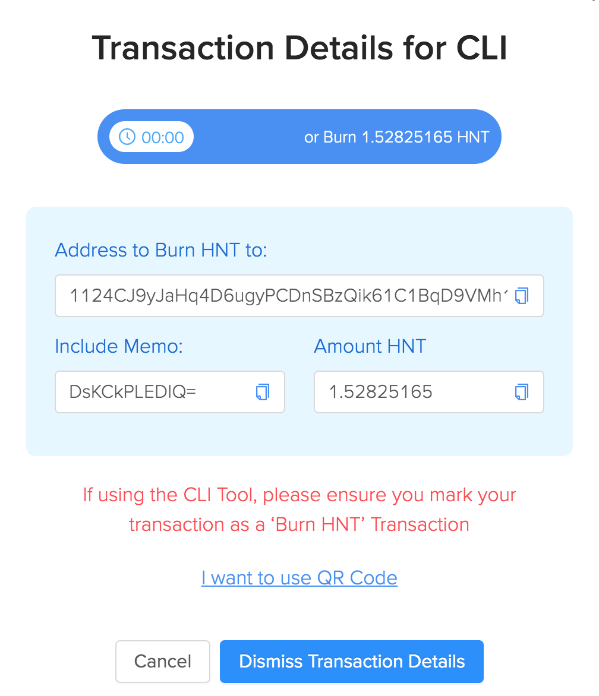

# Blockchain Wallet CLI


The Helium blockchain CLI is an open-source Rust application that allows the user to create secure address key pairs and interact with the blockchain via the command line. This guide will walk you through how to create various types of wallets, and perform some of the different blockchain specific functions.


The Wallet CLI source code [is available on GitHub](https://github.com/helium/helium-wallet-rs). This documentation is current as of **v1.3.9.**



All the command examples below assume you've built the wallet from source. If you've installed from a release on a target platform, simply strip the leading **`./target/release`** from all commands. 



Please be sure to keep wallet files and passwords secure. If you forget a password or lose a key file, they are gone. Back things up in more than one location. This is your responsibility.





## Installation \(from source\)

The Wallet application can either be downloaded from the [GitHub releases page](https://github.com/helium/helium-wallet-rs/releases), or built from source. This guide will walk through building from source.

First, we'll assume you're using a Linux or macOS based system. To build from source you'll need the [Rust programming language](https://www.rust-lang.org) and its package manager, Cargo:

```
$ curl https://sh.rustup.rs -sSf | sh
```

Once Rust is installed, we'll need to check out the Wallet git repo and build it. You'll of course need Git installed first.

```bash
$ git clone https://github.com/helium/helium-wallet-rs.git
$ cd helium-wallet-rs
$ cargo build --release
```

Cargo will pull in all the required dependencies and build the application. Once complete, you should have a binary available as `./target/release/helium-wallet`


You can run `./target/release/helium-wallet -h` or `--help` to get help at any time to get guidance on how to use any of the Wallet CLI commands


## Subcommands

As of version 1.3.4, the following subcommands are available in the CLI. 

* [balance](blockchain-cli.md#balance) - get a wallet balance
* [burn](blockchain-cli.md#burn) - burn HNT to data credits to a target wallet address
* [create](blockchain-cli.md#create) - create a new wallet
* [help](blockchain-cli.md#help) - prints the help contents for a given subcommands
* [hotspots list](blockchain-cli.md#hotspots) - get the Hotspots for a wallet
* [hotspots transfer](blockchain-cli.md#hotspots-transfer) - buy or sell a hotspot for HNT, transferring ownership to another address
* [htlc](blockchain-cli.md#htlc) - create or redeem from an HTLC address
* [info](blockchain-cli.md#info) - get wallet information
* [onboard](blockchain-cli.md#onboard) - onboard a hotspot using a location assertion transaction
* [oracle](blockchain-cli.md#oracle) - report an oracle price to the blockchain
* [oui](blockchain-cli.md#oui) - create or update an OUI
* [pay](blockchain-cli.md#pay) - send one or more payments to a given address
* [securities](blockchain-cli.md#securities) - administer security tokens
* [upgrade](blockchain-cli.md#upgrade) - upgrade a wallet to the latest supported version of the given format
* [vars](blockchain-cli.md#vars) - commands for chain variables
* [verify](blockchain-cli.md#verify) - verify an encrypted wallet

### balance 

Use this to check your local wallet balance, or the balance of any Helium blockchain wallet.

**USAGE**

`helium-wallet balance [OPTIONS]`

**OPTIONS**:

* `-a, --address <addresses>` - Use to specify an address other than your local wallet.

```bash
$ ./target/release/helium-wallet balance
+-----------------------------------------------------+------------+--------------+-----------------+
| Address                                             | Balance    | Data Credits | Security Tokens |
+-----------------------------------------------------+------------+--------------+-----------------+
| 14d5tFhmy5wW98gS3NzDgqsLAAZ54QsMfMy5dNRdsGPw7a7USbC | 0.00000000 | 0            | 0               |
+-----------------------------------------------------+------------+--------------+-----------------+
```

### burn

Use the `burn` subcommand to burn HNT from you CLI wallet into DCs to a target Helium Console organization \(and corresponding wallet address\).

**USAGE**

`helium-wallet burn [FLAGS] [OPTIONS] --amount <amount> --payee <payee> --memo <memo> --commit`

**OPTIONS:**

* `--amount <amount>` Amount of HNT to burn to DCs
* `-- memo <memo>`Memo to include; must be a base64 encoded string. This will be provided by your Helium Console org. 
* `--payee <payee>` Account address to send the resulting DC to. This will be provided by your Helium Console org.

**Obtaining memo and payee info**

Your `memo` and `payee` info can be found in your [Helium Console](https://console.helium.com/) organization. Once logged in, go to the [Data Credits menu](https://console.helium.com/datacredits), and select **Purchase Data Credits**. Enter the amount of DCs you want to convert from HNT, and click the **Burn HNT to DC option**. You'll then be presented with a QR code that can be used to burn HNT from your _Helium Mobile Wallet_ to your Console Org. You don't want this. Instead, click the **I don't want to use QR Code** link under the QR code. You'll then be presented with something like this:



* Use the **Address to Burn HNT** **to** as your `--payee` 
* Use the **Include Memo** info as your `--memo` 
* Use the **Amount HNT** as the `--amount` 


The **Amount HNT** is the amount of HNT required to be burned to convert to amount of Data Credits you specified. This number is calculated based on the current [HNT Oracle Price.](hnt-price-oracles.md)


Using the above info, our full burn command will look like this:

```bash
$ ./target/release/helium-wallet burn --amount 1.52825165 --payee 1124CJ9yJaHq4D6ugyPCDnSBzQik61C1BqD9VMh1vsUmjwt16HNB --memo DsKCkPLEDIQ= --commit

Password: [hidden]
+--------+------------------------------------------------------+
| Key    | Value                                                |
+--------+------------------------------------------------------+
| Payee  | 1124CJ9yJaHq4D6ugyPCDnSBzQik61C1BqD9VMh1vsUmjwt16HNB |
+--------+------------------------------------------------------+
| Memo   | DsKCkPLEDIQ=                                         |
+--------+------------------------------------------------------+
| Amount | 1.52825165                                           |
+--------+------------------------------------------------------+
| Fee    | 35000                                                |
+--------+------------------------------------------------------+
| Nonce  | 11                                                   |
+--------+------------------------------------------------------+
| Hash   | yYtYCrQ_cRgu9lxGLr5CtkTTJj1baaztL5xo6Vs2fB4          |
+--------+------------------------------------------------------+
```

After this is submitted to the blockchain and processed, your Console Org will be the recipient of your Data Credits; and your Helium Wallet balance will reflect the amount of HNT burned \(including the transaction fee\). 

### create

Use this to create a Helium-compatible wallet.

**USAGE**

 `helium-wallet create <SUBCOMMAND>`

**SUBCOMMANDS**

* `basic`  - Create a new basic wallet
* `help`   - Prints this message or the help of the given subcommand\(s\)
* `sharded`  - Create a new sharded wallet

#### Creating a Basic Wallet

To create a simple wallet, run:

```bash
$ ./target/release/helium-wallet create basic
```

This will create a password protected wallet file located at `wallet.key` If you want to output the wallet file to a different location you can specify `-o /path/to/mywalletfile.key` when creating the wallet.

#### Creating a wallet using an existing 12 word seed phrase

If you've been using the Helium Wallet iOS/Android mobile application, you're likely to have an existing wallet and you've hopefully written the 12 word seed phrase down somewhere. To create a CLI wallet using that existing seed phrase you can do this:

```bash
$ ./target/release/helium-wallet create basic --seed
```

The CLI will then prompt you for your `Seed Words:` enter them in the correct order separated by spaces:

```bash
$ Seed Words: word1 word2 word3 ...
```

#### Creating a Sharded Wallet

`Basic` wallets are secured by a single `wallet.key` file. A more secure option is to break your private key into what are called "shards".  To support this, the CLI uses  [Shamir's Secret Sharing](https://github.com/dsprenkels/sss).  

A key can be broken into `N` shards such that recovering the original key needs `K` distinct shards. This can be done by passing options to `create`

```bash
$ ./target/release/helium-wallet create sharded -n 5 -k 3
```

This will create a wallet with `5` shards, with any `3` shards required. The files are stored as `wallet.key.1` through `wallet.key.5` As before, the filename can be specified by passing the `-o` flag during the wallet creation.

### help

Prints relevant help info for target subcommand**.**

**USAGE**

`helium-wallet [OPTIONS] <SUBCOMMAND>`

### hotspots list

Returns all the Hotspots owned by the local wallet or another specified wallet address.

**USAGE**

`helium-wallet hotspots [OPTIONS]`

**OPTIONS**

`-a, --address <addresses>`  - blockchain wallet address to get Hotspots or gateways for

```bash
./target/release/helium-wallet hotspots
+-----------------------------------------------------+-------------------+
| Address                                             | Name              |
+-----------------------------------------------------+-------------------+
| 13QvnWtjpi3HYoBPpcEmqansMyCbJSkRpSthXAJFTaxwUraKKaP | No hotspots found |
+-----------------------------------------------------+-------------------+
```

### hotspots transfer

Buy or sell a hotspot for HNT, transferring ownership to another address


At this point, transferring hotspot from a mobile wallet to a CLI-managed wallet cannot happen directly. You must import the mobile wallet into the CLI to be either the buyer or the seller.


**USAGE**

`helium-wallet hotspots transfer [SUBCOMMAND]`

**SUBCOMMANDS**

* `sell <gateway> <buyer> [price]` - creates the transfer transaction and signs it, outputting the transaction in base64 encoding. Transfer hotspot on the CLI always starts here. 
* `buy <base64_encoded_transaction>`  - imports the base64 encoded output buy the Seller. It is advised to do this without the `--commit` flag initially so t hat the Buyer may review the transaction. Run the command again with the `--commit` flag to sign and submit the transction.

**OPTIONS**

`-a, --address <addresses>`  - blockchain wallet address to get Hotspots or gateways for

```bash
./target/release/helium-wallet hotspots
+-----------------------------------------------------+-------------------+
| Address                                             | Name              |
+-----------------------------------------------------+-------------------+
| 13QvnWtjpi3HYoBPpcEmqansMyCbJSkRpSthXAJFTaxwUraKKaP | No hotspots found |
+-----------------------------------------------------+-------------------+
```

### htlc

Create or Redeem from an HTLC address.

**USAGE**

`helium-wallet htlc <SUBCOMMAND>`

**SUBCOMMANDS**

* `create` - Creates a new HTLC address with a specified hashlock and timelock \(in block height\), and transfers a value of tokens to it. The transaction is not submitted to the system unless the `--commit` option is given
* `help`  - Prints this message or the help of the given subcommand\(s\)
* `redeem`  - Redeem the balance from an HTLC address with the specified preimage for the hashlock

### info

View the info for a local wallet.

**USAGE**

`helium-wallet info [FLAGS]`

**FLAGS**

* `--qr`  - Display QR code for a given single wallet

```bash
$ ./target/release/helium-wallet info
+-----------------------------------------------------+---------+
| Address                                             | Sharded |
+-----------------------------------------------------+---------+
| 14d5tFhmy5wW98gS3NzDgqsLAAZ54QsMfMy5dNRdsGPw7a7USbC | false   |
+-----------------------------------------------------+---------+
```

### onboard

Use an onboarding key get a hotspot added or a location assertion transaction signed by the Helium staking server.

**USAGE**

`helium-wallet onboard [FLAGS] [OPTIONS] [TRANSACTION]`

**FLAGS**

* `--commit`  - Commit the transaction to the blockchain

**OPTIONS**

* ~~`--onboarding <onboarding>`~~  - The onboarding key to use if the payer of the transaction fees is the Helium "staking" server

**ARGS**

* `TRANSACTION` - Base64 encoded transaction to sign. If no transaction if given stdin is read for the transaction. Note that the stdin feature only works if the wallet password is set in the `HELIUM_WALLET_PASSWORD` environment variable

### oracle

Report an oracle price to the blockchain.


Full Documentation on Helium Price Oracles [are here](hnt-price-oracles.md).


**USAGE**

`helium-wallet oracle <SUBCOMMAND>`

**SUBCOMMANDS**

* `-- report`  - Construct an oracle price report and optionally commit it to the Helium Blockchain

### oui

Create or update a Helium blockchain OUI

**USAGE**

`helium-wallet oui <SUBCOMMAND>`

**SUBCOMMANDS**

* `create`  - Allocates an Organizational Unique Identifier \(OUI\) which identifies endpoints for packets to sent to. The transaction is not submitted to the system unless the `--commit` option is given
* `submit`   - Submits a given base64 oui transaction to the API. This command can be used when this wallet is not the payer of the oui transaction

### pay

Sent HNT from one wallet to one or more wallets.

**USAGE**

`helium-wallet pay [FLAGS] --payee <payee=hnt>...`


**FLAGS**

* `--commit`- Required to formally commit the transaction to the API
* `--hash`- Only output the transaction hash
* `--payee, -p`- Precedes the address and amount of HNT to send in `<address>=<amount>` format
* `--file`- Wallet to use as the payer.  Defaults to the local `wallet.key`

When you submit a payment transaction, you will be prompted for the password you used to create the wallet.

The value of HNT you send can be down to 8 decimal places of precision. `0.00000001` is the smallest denomination that could be sent \(also known as a `bone`\).

If the `--hash` flag is passed to the command, the CLI will output the transaction hash which can then be checked against the [Blockchain API](https://developer.helium.com/blockchain/api#get-pending-transaction-status) pending transaction route to see the status of the transaction: 

```bash
https://api.helium.io/v1/pending_transactions/<hash>
```

Or once the transaction has been confirmed:

```bash
https://api.helium.io/v1/transactions/<hash>
```

#### Sending Tokens to more than one HNT Address in a Single Transaction 

As of CLI v1.1.3, you can send HNT to up to `50` wallets in the same CLI command. To do this, simply follow the `--payee <payee=hnt>` format but include multiple addresses and their desired HNT amounts. For example:

```bash
$ ./target/release/helium-wallet pay --commit --payee 13buBykFQf5VaQtv7mWj2PBY9Lq4i1DeXhg7C4Vbu3ppzqqNkTH=100 12z4nUiayZnbW46azcegBBB9yGkchFb1Zm7EPuh6eV1r2HT1NgC=100 14cKr7Qs93gdyLguKXf6Pg2SdryopG7dWSgiC6JWKHozuRQjmK8=100
```


### securities

### upgrade

### vars

### verify

If you have existing wallet files you can verify them by running the `verify` command. You'll be asked for your wallet passphrase. 

```bash
$ ./target/release/helium-wallet verify 
Password: [hidden]
+-----------------------------------------------------+---------+--------+
| Address                                             | Sharded | Verify |
+-----------------------------------------------------+---------+--------+
| 13QvnWtjpi3HYoBPpcEmqansMyCbJSkRpSthXAJFTaxwUraKKaP | false   | true   |
+-----------------------------------------------------+---------+--------+
```

You can pass `-f mywallet.key` to the `verify` command  to use different wallet files.


