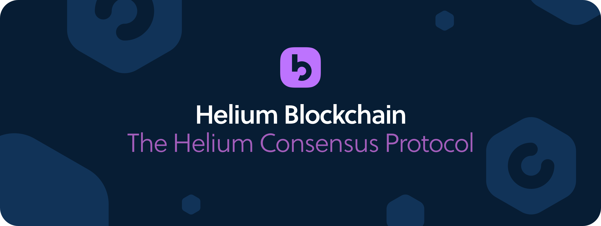

# The Helium Consensus Protocol

The Helium blockchain uses a new consensus protocol, called simply the Helium Consensus Protocol.

## Consensus Protocol Design Goals

In designing the protocol, we wanted to emphasize the following characteristics:

* **Permissionless** - Any Hotspot operating in accordance with the consensus rules and network specifications should be able to participate freely in the Helium Network. 
* **Truly decentralized by design** - No incentive should be available for taking advantage of factors like inexpensive energy cost or deploying more hardware in the same location. 
* **Byzantine Fault Tolerant** - The protocol should be tolerant of Byzantine failures such that consensus can still be reached as long as a threshold of participants are acting honestly. For this, we selected a variant known as Honey Badger BFT detailed below. 
* **Based on useful work** - Achieving network consensus should be useful and reusable to the network. In Nakamoto Consensus-based systems like the bitcoin blockchain, work performed to achieve consensus is only valid for a specific block. By comparison, Helium’s consensus system should perform work that is both useful and reusable to the network beyond simply securing the blockchain. 
* **High rate of confirmed transactions** - The protocol should be able to achieve a high number of transactions per second, and once the transaction is seen by the blockchain it should be assumed confirmed. Users sending device data through the Helium Network cannot tolerate long block settlement times typical of other blockchains. 
* **Censorship-resistant transactions** - Miners should not be able to censor or otherwise select / deselect transactions to be included in a block. 

## HoneyBadger BFT

The Helium Consensus Protocol is based on a variant of the HoneyBadgerBFT \(HBBFT\) protocol. \(HBBFT is based on a body of research originally kicked off by Andrew Miller and the team at the University of Illinois, Urbana-Champaign.\)

HBBFT is an asynchronous atomic broadcast protocol designed to enable a group of known nodes to achieve consensus over unreliable links. In Helium’s implementation, a consensus group of elected Hotspots receives encrypted transactions as inputs and proceeds to reach common agreement on the ordering of these transactions before forming a block and adding it to the blockchain.

HBBFT relies on a scheme known as threshold encryption. Using this scheme, transactions are encrypted using a shared public key, and are only decryptable when the elected consensus group works together to decrypt them. The usage of threshold encryption enables the Helium Consensus Protocol to achieve censorship-resistant transactions.

### Extended Reading

* [HoneyBadger BFT \(PDF\)](https://eprint.iacr.org/2016/199.pdf)
* [Introducing the Helium blockchain](https://blog.helium.com/introducing-the-helium-blockchain-dc2f8997083c)

## The Consensus Group Election

A new Consensus Group is elected once per epoch based on their Hotspot score. You can see the current Consensus Group using the [Helium Network Visualizer](https://network.helium.com/consensus). Currently there are `16` members elected to each consensus group, as defined in the `num_consensus_members` chain variable. \(The intention is to increase this number as the number of Hotspots on the network increases.\)

All Hotspots active on the Helium Network are eligible to be elected to a consensus group. Two primary factors are used as inputs to the selection:

* **Score** - Every Hotspot on the Network has a [score](https://github.com/helium/devdocs/tree/67b988ec351854ec4b7608e12b5b8f47f2456abf/blockchain/proof-of-coverage/README.md#hotspot-scoring), ranging from `0.0` - `1.0`, that is constantly changing to reflect the network’s confidence in its asserted location. Hotspots with higher scores are more likely to be elected to a consensus group. 
* **Geography** - The consensus group selection algorithm attempts to select Hotspots that are distributed geographically. For example, although [three of the top five scoring Hotspots](http://dashboard.helium.com/d/SV1719FWz/hotspots?orgId=1) might be located in Omaha, Nebraska, it’s not likely that all three of them will be elected to a given consensus group. 

At the conclusion of each epoch, a distribution of all active Hotspots is created. Using the above criteria, 16 are selected from this distribution and a new consensus group is formed.

## The Mining Process

Following the election of a new Consensus Group, a distributed key generation phase occurs to bootstrap the threshold encryption key \(TPKE\). This TPKE is a cryptographic primitive that allows any Hotspot in the network to encrypt transactions to a master public key \(PK\) such that the Consensus group must work together to decrypt it.

Hotspots are constantly submitting new transactions to the current consensus group. As they arrive, each consensus group member takes a random subset and forwards them around to other members of the group after encrypting them with their share of the master public key.

## Rewarding Hotspots

At the end of each epoch, mining rewards are distributed by the consensus group to the wallet addresses that have earned them. Currently `65%` of all mining rewards go to the hotspot infrastructure \(with the remaining `35%` being distributed to Helium, Inc and other network investors\). A graphical overview of token reward system can be [viewed here](https://www.helium.com/tokens).

During the course of any epoch, Hotspots are rewarded for the following list of activities:

* Submitting valid proof of coverage challenges \(as a “challenger”\)
* Successful participation in proof of coverage as a target \(as a “challengee”\) 
* Witnessing a proof of coverage challenge
* Transfering device data over the network 
* Serving as consensus group member

The Consensus Group members also split `6%` of all HNT mined, as well as any transaction fees collected during the epoch.

Each one of the above activities is recorded in a block using the `reward` transaction. At the completion of each epoch, all the individual `reward` transactions are grouped in a `rewards` transaction at which point all HNT mined in that epoch are distributed.

