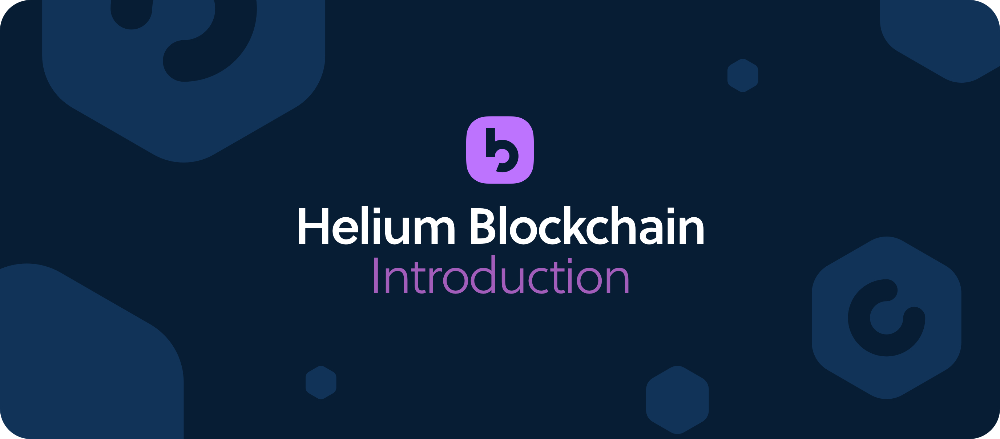
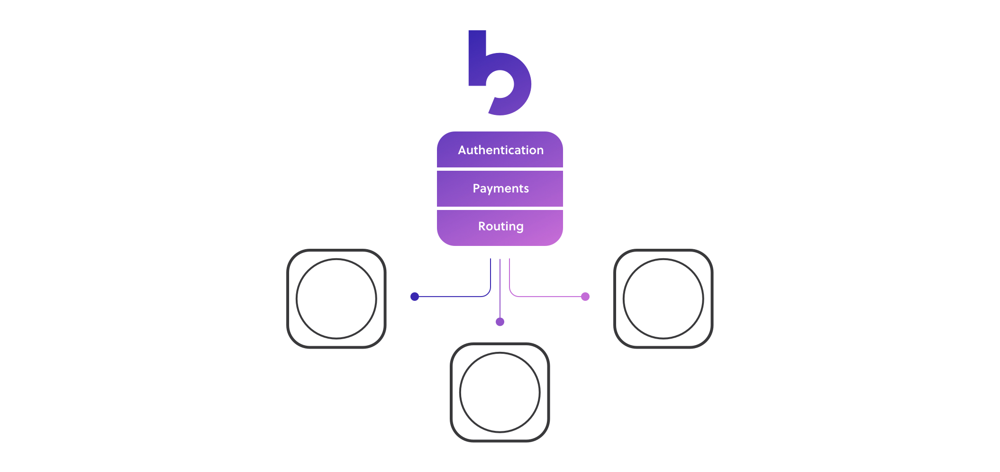

# Introduction

The Helium network is the world’s first peer-to-peer wireless network made for connecting long range, low power devices. It’s built to address the massive connectivity gap needed to enable what’s estimated to be a more-than $1.4 trillion IoT market.

Powering the network is a purpose-built blockchain that handles network security, microtransactions, and packet routing.


The Helium network officially went live on July 29, 2019 and is growing quickly across the United States \(and soon the world\).


This documentation is intended to be a mostly-technical overview of the Helium blockchain. That said, it’s not an exhaustive review and those that are looking for full details on things like algorithms will need to refer to the [open source code that powers the blockchain](%20https://github.com/helium).

