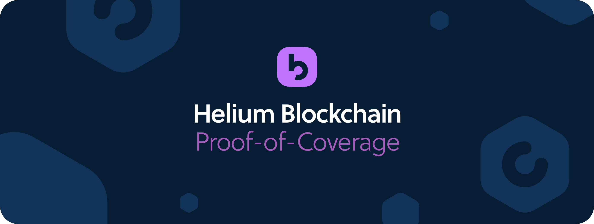
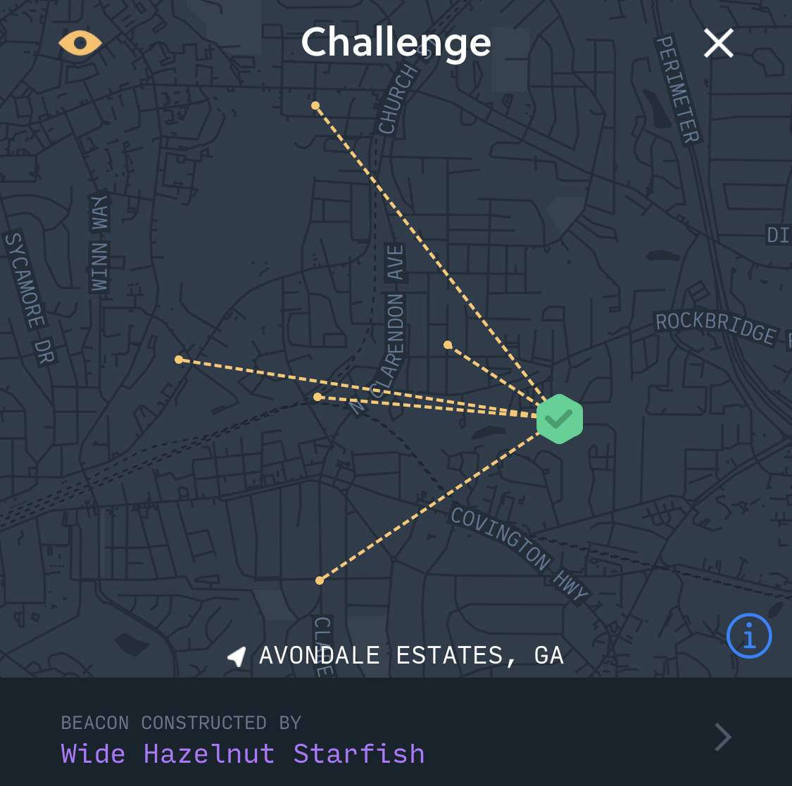

# Proof-of-Coverage

## Proof-of-Coverage and PoC Challenges

Helium uses a novel work algorithm called “Proof-of-Coverage” \(PoC\) to verify that Hotspots are located where they claim \(as established in the assert\_location transaction when they are first deployed\). Put another way, Proof-of-Coverage verifies on an ongoing basis that Hotspots are honestly representing their location and wireless network coverage they are creating from that location.

This section will cover the relationship between PoC and Challenges, as well as how these contribute to a Hotspot’s ability to earn Helium Tokens.


**HIP 15/17 and change to Beacon-only PoC, hex density-based reward scaling**

The Helium Community [has approved HIP 15](https://github.com/helium/HIP/blob/master/0015-beaconing-rewards.md) and [HIP 17](https://github.com/helium/HIP/blob/master/0017-hex-density-based-transmit-reward-scaling.md). This changes proof-of-coverage \(PoC\) from multihop to beaconing, and rewards based on hex-density.


### Why Proof-of-Coverage?

The Helium Network is a physical wireless network that succeeds based on the amount of reliable coverage it can create for users. As such, we needed a proof of work algorithm that was built for this use case. Proof-of-Coverage takes advantage of the unique, undeniable properties of radio frequency \(RF\) to produce proofs that are meaningful to the Helium Network and its participants.

Specifically, PoC makes use of the following characteristics:

* RF has limited physical propagation and, therefore, distance; 
* The strength of a received RF signal is inversely proportional to the square of the distance from the transmitter; and
* RF travels at the speed of light with \(effectively\) no latency;

Using these properties, the Network is constantly testing Hotspots using a mechanism known as a “PoC Challenge”. \(More on these in a moment.\)

The ultimate power of Proof-of-Coverage lies in the fact that the data generated by the ongoing proofs and stored in the Helium blockchain is definitive verification of the wireless coverage provided by, and more specifically, the location of, Hotspots on the network.

### The Anatomy of a PoC Challenge

Individual Proof-of-Coverage challenges can be viewed in [Helium Explorer](https://explorer.helium.com/).

Each Challenge has the following set of participants:

* **Challenger** - The Hotspot that creates a proof and submits it to the blockchain. Hotspots are rewarded for submitting valid Challenges and, as such, submit as many proofs as the Network will allow. Currently each Hotspot can submit one challenge per 240 blocks \(or roughly one per eight epochs\); this challenge interval is subject to change via the chain variable: `poc_challenge_interval`
* **Target** -  Any Hotspot chosen to complete the Challenge \(also referred to as a “challengee”\). 
* **Witness** - A Hotspot that can verify the existence of the Challenge packet over RF. A Witness can also be a Target in any given Challenge.

With this in mind, let’s walk through how a PoC Challenge actually happens on the Helium Network.

### Challenge Proof Construction and Initial Target Selection

Since Hotspots are rewarded for submitting challenge proofs and their receipts to the Network, they construct and submit as many as possible. Collectively, Hotspots submitting valid proofs and the associated proof receipts split `0.95%` of all HNT mined each epoch. \(See the full HNT reward breakdown [here](mining-token-rewards.md#hnt-distributions-per-epoch).\) As noted above, they are currently allowed to submit a challenge proof roughly once per 240 blocks.

The Challenger first generates an ephemeral public/private key pair to be used in the challenge. A SHA256 digest of the public key and the SHA256 digest of the private key are both submitted, along with the current block hash, as a PoC request. If the request is valid and accepted by the blockchain, the hash of the block that the receipt appears in is combined with the hash of the ephemeral public key and the challenger's identity to generate verifiable entropy. A uniform random number generated via this entropy is then used to select the target from the discrete probability distribution of Hotspots.

### Creating the Proof

With the challenge packet created it is then delivered to the target via the Helium Peer-to-Peer Network. The target receives the challenge packet, decrypts the outermost layer using its private key and the ephemeral public key for this challenge \(this ephemeral public key appears in the PoC packet and the receiving Hotspot can inspect the blockchain for an active PoC receipt with the corresponding SHA256 of the ephemeral key\), and immediately broadcasts the resultant packet to the Helium Network. Any number proximate geographic Hotspots will hear it and will Witness the packet.

### The Role of Witnesses

As mentioned above, during the challenge, other Hotspots may hear the RF packet. These Hotspots are known as “witnesses” in the Proof-of-Coverage system. Collectively witnesses earn `8.55%` of all the Helium token rewards produced each epoch.

Witnesses attest to the existence of challenge packets. When an active challenge packet arrives, the witness records the time of arrival, signal strength, and quality, and report this back to the Challenger. The Challenger then includes this receipt, if valid, in the completed challenge proof. Witnesses don't know if the packet they're witnessing is valid or corrupt. Only the Challenger is able to make this determination.

Witnesses are  required for a successful proof. Currently there is a limit of five witnesses per challenge packet layer. A target in a proof can also serve as a witness for challenge packets transmitted by targets other than itself. You can see Witnesses in action using the [Helium Explorer](https://explorer.helium.com) or in the Challenges section of the Helium Mobile Wallet.

### Reward Scaling

For every epoch, each [reward type](mining-token-rewards.md) is split amongst Hotspots who had a role in that reward pool. For example, if your Hotspot was challenged during an epoch, it will be eligible to a portion of the `5.31%` of rewards that go to `PoC Challengees`. A practical way of thinking about this is that a Hotspot might earn a "reward unit" for succeeding at a challenge. If five other Hotspots succeeded at a challenge during the epoch and each of them also earned a "reward unit", then each Hotspot gets 1/5th of the 5.31% of rewards, ie: `181.849446/5.0 = 36.3698892 HNT`.

However, [HIP15](https://github.com/helium/HIP/blob/master/0015-beaconing-rewards.md) and [HIP17](https://github.com/helium/HIP/blob/master/0017-hex-density-based-transmit-reward-scaling.md) each introduced a notion of scaling these "reward units", so the units earned when being witnessed or witnessing a packet scale depending on two things:

* number of witnesses \(aka: packet receiver\), detailed in [HIP15](https://github.com/helium/HIP/blob/master/0015-beaconing-rewards.md)
* number of hotspots in the "hex" tile of the challengee \(aka: packet transmitter\), detailed in [HIP17](https://github.com/helium/HIP/blob/master/0017-hex-density-based-transmit-reward-scaling.md)

The HIPs themselves provide a rich explanation of these mechanisms, but they can be summarized as follows. 

From **HIP15**:

* for the Challengee, the more witnesses, the more the Challengee earns
* for the Witness, each additional witness past 4 reduces what is earned by Witnesses \(the number 4 is a chain var called "witness\_redundancy"\)

From **HIP17**:

* the Witness earns less the more other Hotspots are asserted to the same area \(or hex\) as the Challengee

### Verifying the Proof

Once the Challenger has the complete set of receipts from the proof targets, or the elapsed time since the challenge was issued has passed the upper time bound, the Proof-of-Coverage is considered complete. At this point, the challenger then submits the proof receipt as a transaction to the blockchain to be verified by the current consensus group. Because the steps taken by the Challenger to construct and complete the proof are deterministic and easily reproduced, members of the consensus group can verify the legitimacy of the proof. Specifically the Challenger reveals the secret ephemeral key it used for both obtaining the original PoC request and for encrypting each layer of the challenge packet. This crucial information, which has been hidden until the receipt is published, allows the re-creation of the deterministic entropy.


**Challenge Rewards Require Receipts**

In order for a Challenger to be rewarded for their proof, the receipt of that proof must be successfully received by the blockchain.


