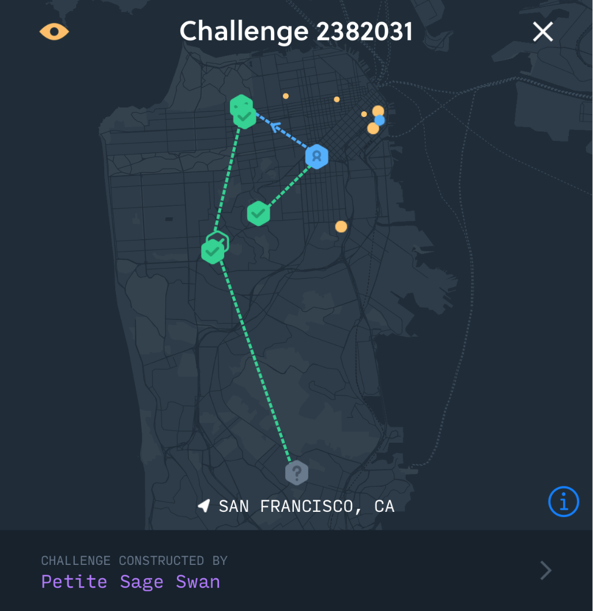

# Proof-of-Coverage

## Proof-of-Coverage and PoC Challenges

Helium uses a novel work algorithm called “Proof-of-Coverage” \(PoC\) to verify that Hotspots are located where they claim \(as established in the assert\_location transaction when they are first deployed\). Put another way, Proof-of-Coverage verifies on an ongoing basis that Hotspots are honestly representing their location and wireless network coverage they are creating from that location.

This section will cover the relationship between PoC and Challenges, how these contribute to a Hotspot’s “score” over time, and how this relates to their ability to earn Helium Tokens.

### Why Proof-of-Coverage?

The Helium Network is a physical wireless network that succeeds based on the amount of reliable coverage it can create for users. As such, we needed a proof of work algorithm that was built for this use case. Proof-of-Coverage takes advantage of the unique, undeniable properties of radio frequency \(RF\) to produce proofs that are meaningful to the Helium Network and its participants.

Specifically, PoC makes use of the following characteristics:

* RF has limited physical propagation and, therefore, distance; 
* The strength of a received RF signal is inversely proportional to the square of the distance from the transmitter; and
* RF travels at the speed of light with \(effectively\) no latency;

Using these properties, the Network is constantly testing Hotspots using a mechanism known as a “PoC Challenge”. \(More on these in a moment.\)

The ultimate power of Proof-of-Coverage lies in the fact that the data generated by the ongoing proofs and stored in the Helium blockchain is definitive verification of the wireless coverage provided by, and more specifically, the location of, Hotspots on the network.

### The Anatomy of a PoC Challenge

Individual Proof-of-Coverage challenges can be viewed in [Helium Explorer](https://explorer.helium.com/).

Each Challenge has the following set of participants:

* **Challenger** - The Hotspot that creates a proof and submits it to the blockchain. Hotspots are rewarded for submitting valid Challenges and, as such, submit as many proofs as the Network will allow. Currently each Hotspot can submit one challenge per 60 blocks \(or roughly one per two epochs\).
* **Target** -  Any Hotspot chosen to complete the Challenge \(also referred to as a “challengee”\). The minimum number of targets per challenge is two; and the maximum number is seven. All targets in any given Challenge are located in the same geography such that they are able to communicate over RF with at least one target. The Targets do not need to be in geographic proximity to the Challenger.
* **Witness** - A Hotspot that can verify the existence of the Challenge packet over RF at any stage in the Challenge path. A Witness can also be a Target in any given Challenge.

With this in mind, let’s walk through how a PoC Challenge actually happens on the Helium Network.

### Challenge Proof Construction and Initial Target Selection

Since Hotspots are rewarded for submitting challenge proofs and their receipts to the Network, they construct and submit as many as possible. Collectively, Hotspots submitting valid proofs and the associated proof receipts split `1%` of all HNT mined each epoch. \(See the full HNT reward breakdown [here](https://www.helium.com/tokens).\) As noted above, they are currently allowed to submit a challenge proof roughly once per 60 blocks.

The challenge process begins with the Challenger selecting an initial target Hotspot. The blockchain maintains a discrete probability distribution of Hotspots according to their score that’s used by the Challenger when selecting the initial target. Lower scoring Hotspots have a higher probability of being selected as the initial target because the Network wants to give them the opportunity to increase their score by participating in challenges. Specifically the POC algorithm tries to target Hotspots close to the neutral score \(`.25`\) in order to move that score either towards `1.0` or towards `0.0`, depending on how they perform.

\(See the [Hotspot Scoring](proof-of-coverage.md#hotspot-scoring)\) for more details on what causes a Hotspot’s score to increase or decrease over time.\)

The Challenger first generates an ephemeral public/private key pair to be used in the challenge. A SHA256 digest of the public key and the SHA256 digest of the private key are both submitted, along with the current block hash, as a PoC request. If the request is valid and accepted by the blockchain, the hash of the block that the receipt appears in is combined with the hash of the ephemeral public key and the challenger's identity to generate verifiable entropy. A uniform random number generated via this entropy is then used to select an initial target from the discrete probability distribution of Hotspots.

### Constructing The Multi-layer Challenge

This phase of the challenge begins with the Challenger selecting a target, followed by set of Hotspots known by the blockchain to be within a continuous radio network of said target. Challenge packets are transmitted over RF using the Hotspot’s on-board sub GHz radio, so the distance between any two targets must be achievable using this RF link. A Hotspot’s location is established in the `assert location` transaction used when deployed.

Once complete, the Challenger constructs a multi-layer challenge packet that is to be completed by the challenge targets. This multi-layer packet is essentially an “envelope of envelopes”, with each layer of the packet only decryptable by its intended target. The innermost packet layer is then created and added to the challenge packet, encrypted using the Diffie-Hellman exchange of the public key of the final target \(accessible via the blockchain\) and the ephemeral private key. This layer creation and encryption process repeats for each target in the challenge list until the complete challenge packet has been completed.

As an additional measure the PoC packet is encrypted and decrypted in such a way that the length of the packet remains constant at each layer. This means that no target along the path \(other than the first hop\) knows its position in the path, or if it is the final hop.

### Creating the Proof

With the multi-layer challenge packet created it is then delivered to the initial target via the Helium Peer-to-Peer Network. The initial target receives the challenge packet, decrypts the outermost layer using its private key and the ephemeral public key for this challenge \(this ephemeral public key appears in the PoC packet and the receiving Hotspot can inspect the blockchain for an active PoC receipt with the corresponding SHA256 of the ephemeral key\), and immediately broadcasts the resultant packet to the Helium Network. Although this packet only has one intended target \(which is unknown to the sender\), it’s likely that any number proximate geographic Hotspots will hear it. \(Hotspots that hear challenges packets but that cannot decrypt them are called “Witnesses.” More on these below.\)

When the intended target receives the packet, it records both the time of arrival and the signal strength of the packet. If it’s able to decrypt the packet, it creates a signed receipt that includes both the time of arrival and the signal strength data, and signs it with its private key. Finally, it sends this signed receipt back to the original Challenger \(which is looked up via the SHA256 of the ephemeral key to find the challenger\) via the Helium Network, and broadcasts the remainder of the challenge packet over the Helium wireless link to its geographic peers. This process continues until all targets in the challenge path have sent signed receipts back to the challenger, or the challenge fails. The final layer of the onion is intentionally padded so that no challengee knows if they are the last hop in the path. And because the final challengee transmits the challenge packet to other Hotspots, this packet can be witnessed.

### The Role of Witnesses

As mentioned above, during the course of a given challenge, a Hotspot may hear a PoC challenge packet but not be able to decrypt it if it’s not the intended recipient. These Hotspots are known as “witnesses” and still have immense value in the Helium Network and the Proof-of-Coverage system. Collectively witnesses earn `9%` of all the Helium token rewards produced each epoch.

Witnesses bolster the strength of the Helium Network by attesting to the existence of challenge packets. It’s analogous to witnessing a car crash from the sidewalk. Though you weren’t involved directly, you can report what happened to the authorities when they need details. This is what a Witness does for challenges. When an active challenge packet arrives that they can’t decrypt, they record the SHA256 of the packet they saw, along with the time of arrival and signal strength, and report this back to the Challenger. The Challenger then includes this receipt, if valid, in the completed challenge proof. Witnesses don't know if the packet they're witnessing is valid or corrupt. Only the Challenger is able to make this determination.

Though witnesses are not required for a successful proof, they are likely to be present. Currently there is a limit of five witnesses per challenge packet layer. A target in a proof can also serve as a witness for challenge packets transmitted by targets other than itself. You can see Witnesses in action using the [Helium Explorer](https://explorer.helium.com) or in the Challenges section of the Helium Mobile Wallet.

### Verifying the Proof

Once the Challenger has the complete set of receipts from the proof targets, or the elapsed time since the challenge was issued has passed the upper time bound, the Proof-of-Coverage is considered complete. At this point, the challenger then submits the proof receipt as a transaction to the blockchain to be verified by the current consensus group. Because the steps taken by the Challenger to construct and complete the proof are deterministic and easily reproduced, members of the consensus group can verify the legitimacy of the proof. Specifically the Challenger reveals the secret ephemeral key it used for both obtaining the original PoC request and for encrypting each layer of the challenge packet. This crucial information, which has been hidden until the receipt is published, allows the re-creation of the deterministic entropy.


**Challenge Rewards Require Receipts**

In order for a Challenger to be rewarded for their proof, the receipt of that proof must be successfully received by the blockchain.


