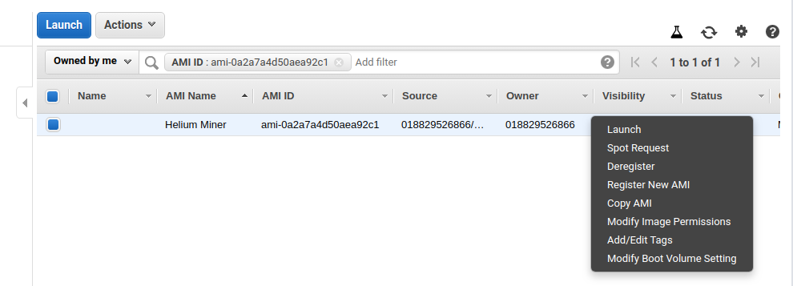
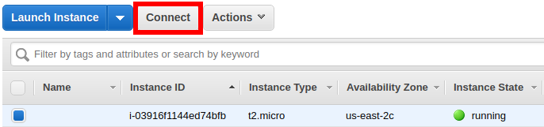

# Run Your Own Miner

Running a Helium Miner is a great way to get some exposure to the blockchain and to support the network. If you have [your own hardware deployed](../hotspot/developer-setup.md), this is necessary for routing LoRaWAN packets according to our [LongFi](https://developer.helium.com/longfi/introduction) protocol.


As you can see above, the Miner is central in routing data across the Helium Network. It is one of three pieces:

* Packet Forwarder: this is a utility that interacts with the radio front-end and sends and receives raw radio packets with the Helium Miner
* Miner: the Helium Blockchain comes into the picture here; the Miner is responsible for routing packets to the appropriate Router \(see [our Routing article](../longfi/longfi-routing.md)\) and entering into micro-transactions brokered via libp2p
* Router: a Helium compatible LoRaWAN Network Server, basically; this component is interested in receiving the packets relating to its devices and handles downlink messages when appropriate

In addition to packet routing, the Miner is central in connecting to other Miners over libp2p where, amongst other things, it is gossiping and saving blocks, while maintaining a ledger of the blockchain.

In this guide, we offer three ways of getting a Miner running:

* deploying a plug-and-play AMI on AWS, if you want an easy setup and to minimize the initial sync time
* run a Docker image, if you want better flexibility in deploying and maintaining your miner without the complexity of building 
* building from source on a Debian-based system, if you really want to get into the nitty-gritty

A Docker container for the miner is coming soon as well, which will allow for an easy setup without restricting you to AWS.

## Deploy an AMI

To deploy a ready made AMI, make sure you are logged into your AWS account, then go to:

\*\*\*\*[**https://us-east-1.console.aws.amazon.com/ec2**](https://us-east-1.console.aws.amazon.com/ec2)

On the left menu, click Images -&gt; AMIs


To the left of the search bar, select “Public Images” and then search:

`AMI ID: ami-01ce02ff33f51418f`

You can quickly launch by clicking Launch, but if you’d rather launch from a region other than us-east1, you’ll want to make a Copy of the AMI to that region before launching.



From launch, select what kind of instance you want; a t2.medium instance seems to balance out cost and computation/networking abilities, but is unfortunately not free.

During the instance configuration, you’ll want to be careful about setting the security group to allow for Miner and Packet Forwarder Traffic.

**Note**: if you are _not_ using a packet forwarder, you can skip the packet forwarder settings. And if you want to be more careful, you can allow packet forwarder traffic only from the IP of your packet forwarder instead of all IPs.


At this point, the instance is running and the Miner is running at boot. To connect to the Miner, follow the AWS instructions:



Once you connect with your desired method, you're running a Helium Miner! Skip on down to the **Using the Miner** section, unless you want to read the other sections for background. 

Just know that this AMI runs the Miner inside of a Docker container. An alias makes interacting with the miner concise \(just `miner`\), but checking the logs for example looks like this:

```text
docker exec miner tail -f /var/log/miner/console.log
```

## Run a Docker Container

Miner releases are available as amd64 and arm64 images on at [quay.io](https://quay.io/repository/team-helium/miner?tab=tags). These will run on any machine of these two architectures which feature an OCI-compliant runtime such as Docker. For simplicity, this guide will help run the image with Docker.

**WARNING**: ****quay.io has some arm32 images, but those do not work!

**Note**: the AMI image detailed above is configured as described here.

### Start Container

Before running the container for the first time, it is advisable to pick a 'system mount point\`, ie: a directory in your host system; some long-term miner data is stored there. This allows you to easily maintain your miner's blockchain identity \(ie: swarm keys\) and blockchain state through miner image updates.

If you are using a Linux system, you can just create a directory in your user's home directory:

```text
mkdir ~/miner_data
```

If you are using Ubuntu as user ubuntu, this path would now be `/home/ubuntu/miner_data`. This will be used later.

Now you can try the `run` command to start your container for the first time:

```
docker run -d \
--restart always \
--publish 1680:1680/udp \
--name miner \
--mount type=bind,source=/home/ubuntu/miner_data,target=/var/data \
quay.io/team-helium/miner:miner-xxxNN_YYYY.MM.DD
```

Replace xxxNN with the architecture used, ie: amd64 or arm64, and with the release date of the image.

The `-d` option runs in detached mode, which makes the command return or not; you may want to omit if you have a daemon manager running the docker for you.

The `--restart always` option asks Docker to keep the image running, starting the image on boot and restarting the image if it crashes. Depending on how you installed Docker in your system, it'll start on boot. In the AWS AMI above, we use systemd \(`systemctl status docker` to check\).

The `--publish 1680:1680/udp` binds your system port 1680 to the containers port 1680, where the Miner is hosting a packet forwarder UDP server; this is necessary if you want to do any radio interactions with your miner.

The `--name miner` names the container, which makes interacting with the docker easier, but feel free to name the container whatever you want.

The `--mount` with the parameters above will mount the container's `/var/data/` directory to the systems directory `/home/ec2-user/miner_data`.   

### Interact with the Miner within the Container

You may want to interrogate the Miner or interact with it it as described in [Using the Miner](run-your-own-miner.md#using-the-miner). Docker's `exec` command enables this, eg:

```text
docker exec miner miner info height
```

In other words, prepend `docker exec miner` to any of the commands documented in Using [Using the Miner](run-your-own-miner.md#using-the-miner). Or simply create an alias such as: `alias miner="docker exec miner miner"`

Another useful trick is following the logs from the miner and looking for packets from a packet forwarder. The command becomes:

```text
docker exec miner tail -f /var/log/miner/console.log | grep lora
```

### Updating the Docker Image

From time to time, the Helium Miner is updated. Keep tabs on [the releases here](https://github.com/helium/miner/releases). Depending on whether you are running a miner for fun, to route packets, or to participate in POC, keeping it updated may be more or less urgent. Each release tagged on the Github will be on the quay repository. Simply remove the current image:

```text
docker stop miner && docker rm miner
```

And [Start the Container ](run-your-own-miner.md#start-container)again as described above, but with the new release tag! Thanks to the `--mount` option, the blockchain data and the miner keys are preserved through updates.

## Installing Miner from Source

First, you'll need [git](https://git-scm.com/). If you don't have it installed:

```bash
sudo apt-get install git
```

Clone the git repository:

```text
git clone https://github.com/helium/miner.git
```

### Install Erlang

Miner has been tested against Erlang OTP 21.3.3.

To install OTP 21.3.3 in Raspian, we'll first acquire the Erlang package from [Erlang Solutions](https://www.erlang-solutions.com/resources/download.html):

```text
wget https://packages.erlang-solutions.com/erlang/debian/pool/esl-erlang_22.1.6-1~raspbian~buster_armhf.deb
```

Now we'll install various other dependencies and then install Erlang itself. You'll see some errors after running `dpkg`, you can ignore them:

```text
$ sudo apt-get install libdbus-1-dev autoconf automake libtool flex libgmp-dev cmake libsodium-dev libssl-dev bison libsnappy-dev libclang-dev doxygen
$ sudo dpkg -i esl-erlang_22.1.6-1~raspbian~buster_armhf.deb
$ sudo apt-get install -f
```

### Compile the Miner

Now it's time to build the miner. This will take a while:

```text
$ cd miner
$ make release
```

## Setting up the Miner

In this section, we will have you configure a newly setup Miner. This section is not necessary when using the AWS AMI the Miner is already up and running upon deployment. Nonetheless, if you want to learn more, this section might be interesting background.

### Editing the configuration

The `sys.config` will need to be edited to match your configuration. Assuming you aren't using Helium Hotspot hardware you'll need to change the following lines of the configuration file:

```text
nano _build/prod/rel/miner/releases/0.1.0/sys.config
```

Find the following line:

```erlang
{key, {ecc, [{key_slot, 0}, {onboarding_key_slot, 15}]}},
```

And change it to:

```erlang
{key, undefined},
```

And this line:

```erlang
{use_ebus, true},
```

Should be changed to:

```erlang
{use_ebus, false},
```

You can also edit `log_root`, `base_dir` and `update_dir` to be appropriate for whatever you prefer on your system. For the rest of the guide we'll assume you didn't change these values.

Again press `ctrl-x` to save and exit.

You will also want to increase the open file limit. Note that make the change this will only be effective until you reboot:

```text
ulimit -n 64000
```

### Putting Miner in Your Environment

For the rest of this guide, we will assume you've exported the miner root to your PATH and that you've aliased `miner` to the executable \(eg: _build/prod/rel/miner/bin/miner_\).

On the AWS AMI, this is already done for you. Otherwise, this should work on most Linux environments `~/.bashrc`:

```text
export PATH=$PATH:$HOME/miner
alias miner=$HOME/miner/_build/prod/rel/miner/bin/miner
```

### Starting Up

If you are using the AWS AMI, systemd is running the Miner for you. Otherwise, you can run the Miner in the background, or via an interactive console.


**Note**: because we assume you did not change `log_root`, `base_dir` or `update_dir` in the previous step you'll have to run these commands as root using `sudo` otherwise the default `pi` user won't have sufficient permission to access these directories. If you changed these values in the previous step, you won't have to run as root here.


To run in the background \(recommended\):

```text
sudo _build/prod/rel/miner/bin/miner start
```

After a few moments you should be back at the shell prompt. Don't worry, that's a good thing.

If you're an advanced user, you might instead want to run miner via the interactive console:

```text
sudo _build/prod/rel/miner/bin/miner console
```

If you run in console mode, you'll need to open another SSH session to the Pi to execute any other commands, or use a tool like `tmux` if you're an advanced user. We'd recommend running in the background for now.


**Note**: if you want to avoid running the miner as `sudo`, you'll want to either adjust the paths used in sys.config or change ownership of the default `/var/data`. For the interest of brevity, we are running the miner as `sudo`


### Loading the Genesis block

If you are using the AWS AMI, the Miner has the genesis block loaded and is at least partially synced. If you are running from source or have wiped your blockchain data, you'll need to load the genesis block.

First, you need a genesis block for the main network.

```text
wget https://github.com/helium/blockchain-api/raw/master/priv/prod/genesis
```

Now you'll need to load the genesis block in to your miner:

```text
miner genesis load ~/miner/genesis
```

You should now be able to check your block height and see a height of 1, which is the genesis \(first\) block:

```text
miner info height
```

The first number is the election epoch and the second number is the block height of your miner.

As blocks get gossiped around from peers in your peerbook and added to your local chain you should see both of these numbers go up. It will take several hours or more to catch up to the tip of the blockchain.

To check, you can either check the mobile app, check [the browser-based block explorer](https://network.helium.com/blocks), or run a simple curl command to check in a Terminal:

```text
~$ curl https://api.helium.io/v1/blocks/height
{"data":{"height":280775}}
```

## Using the Miner

### Checking the logs

Unless you've changed things in `sys.config`, you can find the logs at `/var/log/miner`.

These can be helpful at anytime to get some idea of what's going on:

```text
tail -f /var/log/miner/console.log
```

Beware, as is very common in Linux logs, the file is rotated from time to time. So if you see that logs aren't streaming in anymore, exit out of the `tail`instance and run the command again.

### Checking the peer-to-peer network

This is the first health check you can do to see how your Miner is doing. Is it finding other Helium miners over libp2p properly?

The Helium blockchain uses an Erlang implementation of [libp2p](https://libp2p.io/). Because we expect Hotspot hardware to be installed in a wide variety of networking environments [erlang-libp2p](https://github.com/helium/erlang-libp2p) includes a number of additions to the core specification that provides support for NAT detection, proxying and relaying.

The first order of business once the Miner is running is to see if you're connected to any peers, whether your NAT type has been correctly identified, and that you have some listen addresses:

```text
miner peer book -s
```

You will see an output roughly like the following:

```bash
+--------------------------------------------------------+------------------------------+------------+-----------+---------+------------+
|                        address                         |             name             |listen_addrs|connections|   nat   |last_updated|
+--------------------------------------------------------+------------------------------+------------+-----------+---------+------------+
|/p2p/11dwT67atkEe1Ru6xhDqPhSXKXmNhWf3ZHxX5S4SXhcdmhw3Y1t|{ok,"genuine-steel-crocodile"}|     2      |    13     |symmetric|   3.148s   |
+--------------------------------------------------------+------------------------------+------------+-----------+---------+------------+

+----------------------------------------------------------------------------------------------------------------------------+
|                                                 listen_addrs (prioritized)                                                 |
+----------------------------------------------------------------------------------------------------------------------------+
|/p2p/11apmNb8phR7WXMx8Pm65ycjVY16rjWw3PvhSeMFkviWAUu9KRD/p2p-circuit/p2p/11dwT67atkEe1Ru6xhDqPhSXKXmNhWf3ZHxX5S4SXhcdmhw3Y1t|
|                                                 /ip4/192.168.3.6/tcp/36397                                                 |
+----------------------------------------------------------------------------------------------------------------------------+

+--------------------------+-----------------------------+---------------------------------------------------------+------------------------------+
|          local           |           remote            |                           p2p                           |             name             |
+--------------------------+-----------------------------+---------------------------------------------------------+------------------------------+
|/ip4/192.168.3.6/tcp/36397|/ip4/104.248.122.141/tcp/2154|/p2p/112GZJvJ4yUc7wubREyBHZ4BVYkWxQdY849LC2GGmwAnv73i5Ufy|{ok,"atomic-parchment-snail"} |
|/ip4/192.168.3.6/tcp/36397| /ip4/73.15.36.201/tcp/13984 |/p2p/112MtP4Um2UXo8FtDHeme1U5A91M6Jj3TZ3i2XTJ9vNUMawqoPVW|   {ok,"fancy-glossy-rat"}    |
|/ip4/192.168.3.6/tcp/36397| /ip4/24.5.52.135/tcp/41103  |/p2p/11AUHAqBatgrs2v6j3j75UQ73NyEYZoH41CdJ56P1SzeqqYjZ4o |  {ok,"skinny-fuchsia-mink"}  |
|/ip4/192.168.3.6/tcp/46059| /ip4/34.222.64.221/tcp/2154 |/p2p/11LBadhdCmwHFnTzCTucn6aSPieDajw4ri3kpgAoikgnEA62Dc6 | {ok,"skinny-lilac-mustang"}  |
|/ip4/192.168.3.6/tcp/33547| /ip4/34.208.255.251/tcp/443 |/p2p/11VjFZM14JK3oecVuVfYSgAM9oZy1J98kQW8AZMQgLZC4p4noih |   {ok,"fast-pebble-snake"}   |
|/ip4/192.168.3.6/tcp/36397|  /ip4/45.33.47.34/tcp/443   |/p2p/11apmNb8phR7WXMx8Pm65ycjVY16rjWw3PvhSeMFkviWAUu9KRD |{ok,"radiant-cobalt-tadpole"} |
|/ip4/192.168.3.6/tcp/36397| /ip4/67.48.33.86/tcp/49909  |/p2p/11ckxdQsReXpqwCrbbREZj6urEuNEGf2Zk5d4UnsuPMsJDSihwy |{ok,"orbiting-cream-starfish"}|
|/ip4/192.168.3.6/tcp/36397|/ip4/73.241.19.171/tcp/45312 |/p2p/11dj5k2dwSUE7fqFnwAHK9stLd3St9MJiJuaRnvvRgJjbRMZgKJ |   {ok,"micro-tiger-tuna"}    |
|/ip4/192.168.3.6/tcp/36397| /ip4/178.128.88.28/tcp/443  |/p2p/11sRJ9L6nenuBDK8RNvswXThvu6aYyPNA7Rsq6bV1dWG1veyYaS | {ok,"curved-rouge-hedgehog"} |
|/ip4/192.168.3.6/tcp/36397|/ip4/54.152.161.170/tcp/2154 |/p2p/11tZZW54iY4WF481DmrMdVe2QVi2K9m6dXEZps6GvPTqyWZp5V3 |{ok,"harsh-honeysuckle-shark"}|
|/ip4/192.168.3.6/tcp/36397|/ip4/70.113.51.183/tcp/61383 |/p2p/11vsUeTb8g4KcELPctghGLSDWhUDGAEAkiAhERU3euC69HSNvca |  {ok,"long-rosewood-boar"}   |
|/ip4/192.168.3.6/tcp/36397|/ip4/104.248.206.159/tcp/443 |/p2p/11wDt78AktL5ZMmV8ePxZWAu8wyVRLbArFeqhCVExzyd3HP6hQa |   {ok,"fluffy-sand-yeti"}    |
|/ip4/192.168.3.6/tcp/36397|/ip4/192.168.2.134/tcp/62146 |/p2p/11xxCzYzQAxhfazMVa6vi7QBD4ct85baw7FLG9KPmERVttXBKhQ |{ok,"beautiful-coffee-oyster"}|
+--------------------------+-----------------------------+---------------------------------------------------------+------------------------------+
```

As long as you have an address listed in `listen_addrs` and some peers in the table at the bottom, you're connected to the p2p network and good to go.

If you are having trouble, try forwarding port `44158` to the miner. On AWS, double check your security group settings.

### Checking Block Height

As long as a genesis block is loaded, this query will work and return height 1 at least:

```text
miner info height
```

If you are syncing, you should see something like this:

```text
~$ miner info height
6889        280756
```

The first number is the election epoch and the second number is the block height of your miner. If you just launched an AMI instance, your Miner is been disconnected, or you simply have a slow connection, you may be a few blocks behind. To check, you can either check the mobile app, check [the browser-based block explorer](https://network.helium.com/blocks), or run a simple curl command to check in a Terminal:

```text
~$ curl https://api.helium.io/v1/blocks/height
{"data":{"height":280756}}
```

### Locating and Migrating Your Swarm Keys

Periodically, we may release updates or you may want to migrate your miner from one machine to another. If the miner has been asserted to the blockchain, you will want to be careful maintaining your identity via a copy of the "swarm key" \(this maps directly to the friendly three word name of your miner\). 

The default location of the swarm\_key \(may be edited in sys.config\), is here:

```text
/var/data/miner/swarm_key
```

Note that for production hotspots sold by Helium, the swarm key is stored inside of a secure element and is thus unable to be migrated.

### Providing Coverage

While participating in libp2p is helpful for the network, the Helium Blockchain does not exist for its own sake. It is there to incentivize coverage and one of the ways to earn tokens as a coverage provider for Helium is by routing IoT traffic.

To learn more about this, check out the [Build a Hotspot](../hotspot/developer-setup.md) section.

