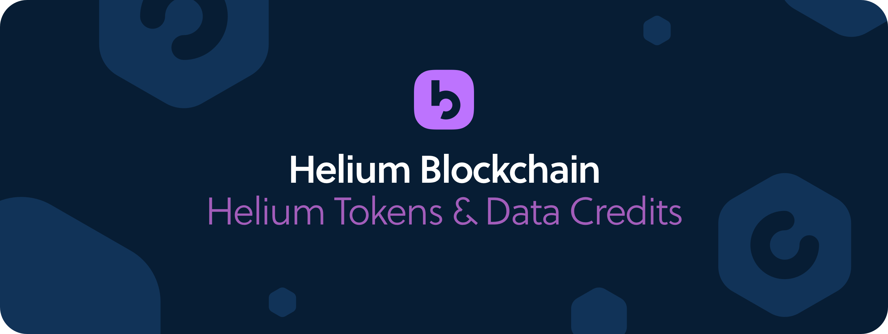

# Helium Tokens and Data Credits

The Helium blockchain makes use of two tokens in parallel as part of a design known as a “burn and mint equilibrium”:

* [**The Helium Token**](tokens.md#the-helium-token) – used to reward Hotspot Operators and Helium Network Investors 
* [**Data Credits**](tokens.md#data-credits) – derived from HNT in an on-chain burn transaction and used to pay transaction fees on the Helium Network


**HIP 20 and Max HNT Supply**

The Helium Community [has approved HIP 20](https://github.com/helium/HIP/blob/master/0020-hnt-max-supply.md). This introduces Halvenings, Net Emissions, and a Max Supply of 223MM HNT. Read more [here](https://www.helium.com/hnt) and [here](https://dewialliance.medium.com/helium-community-approves-hip-20-127cf75303bf).



**HIP 15/17 and change to Beacon-only PoC, hex density-based reward scaling**

The Helium Community [has approved HIP 15](https://github.com/helium/HIP/blob/master/0015-beaconing-rewards.md) and [HIP 17](https://github.com/helium/HIP/blob/master/0017-hex-density-based-transmit-reward-scaling.md). This changes proof-of-coverage \(PoC\) from multihop to beaconing, and rewards based on hex-density.


## The Helium Token

The Helium Token is the native cryptocurrency and protocol token of the Helium blockchain. Its symbol is `HNT`.

The first `HNT` was produced on July 29th, 2019 at 09:43PM UTC as part of the genesis block that was mined with the Helium Network launch. Prior to this date, there was no premine of `HNT`.  Today, the target mining rate is `5,000,000 HNT` per month \(as defined in the `monthly_reward` chain variable. `5,000,000 HNT` are produced when the target blocktime and epoch times \(as defined in their respective chain variables\) are achieved over a one month period. This rate will drop to `2,500,000 HNT` per month at the first halvening, scheduled for August 1, 2021.


**What's Smaller Than One HNT?**

One HNT is made up of `100,000,000` “bones”.  Therefore, the smallest piece of a HNT that can be used as part of a transaction is `0.00000001`,  or `1` bone.


### Helium Token Usage

The Helium Token is designed to serve the needs of the two primary parties of the Helium blockchain ecosystem: 1\) Hotspot Hosts and 2\) Enterprises and developers using the Helium Network to connect devices and build applications. HNT is used to reward Hosts for deploying and maintaining network coverage. Enterprises and developers then use Data Credits, which are derived from HNT in a burn transaction, to pay transaction fees for the data transmissions on the network.

### Helium Token Distribution

At the conclusion of each epoch, 100% of the HNT produced are distributed across the following categories:

* **30%** – Network Data Transfer 
* **35%** - Hotspot Infrastructure 
* **35%** - Helium, Inc and Investors 


### Extended Reading

A complete breakdown of the token reward distribution can be found in the [Mining and Token Rewards section](mining-token-rewards.md). 


## Data Credits

Data Credits - knows as `DCs` - are used to pay all transaction fees on the Helium Network. DCs are created using an on-chain burn transaction which converts HNT to DCs at a rate pegged to the $US. In other words, the price of a DC will always be fixed. However, the amount of DCs produced by burning HNT will move up and down based on the $USD price of HNT as reported by the [HNT Oracles](hnt-price-oracles.md).

**Scenario 1**

* The price of one DC is `$.00001`
* The current HNT Oracle price is `$1`
* Burning `1` HNT would produce `100,000` DCs

**Scenario 2**

A Helium Network user requires 50,000 DCs per month to send data for their fleet of dog trackers. To acquire these 50,000 DCs per month, they would burn .5 HNT using the following math:

* The price of one DC is `$.00001`
* The current HNT Oracle price is `$1`
* Burning `.5` HNT would produce the needed `50,000` DCs


**Data Credits are non-transferrable and non-exchangable**

Once burned, DCs are owned by the Helium wallet specified in the burn transaction. They are non-transferrable and can only be used by the wallet owner.


The HNT / DC relationship is based on a design commonly called a “burn and mint equilibrium” and is intended to allow for the supply of HNT to respond to network usage trends such that, when equilibrium is found, the amount of HNT that exists remains static month on month. \(Helium borrowed heavily from Factom’s usage of this design though other blockchains have also used it.\)

### Extended Reading

* [Burn and Mint Equillibrium](https://multicoin.capital/2018/02/13/new-models-utility-tokens/)

