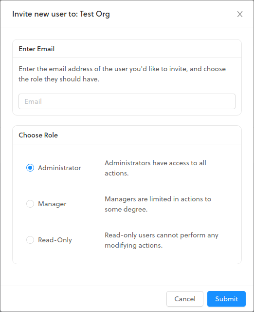

# Users

## User Roles

The first user to register a new organization is given the highest role of administrator. To add a new user, navigate to the **Users** page using the left side navigation, and then click **+ Add User** in the upper right. You will be presented with the screen below. You will find more details about the access that each role has further below.

### User Role Details

* Administrator
  * Manage Devices
  * Manage Labels
  * Manage Data Credits
  * Manage Users
* Manager
  * Manage Devices
  * Manage Labels
* Read-Only
  * View Devices

## Organizations

An Organization is created when registering an account. You can add additional Organizations by navigating to the **Dashboard** page using the left side navigation, and then click **+ Add Organization** in the upper right. To switch to another Organization click the **Switch** button on the list of Organizations on the **Dashboard** page.

