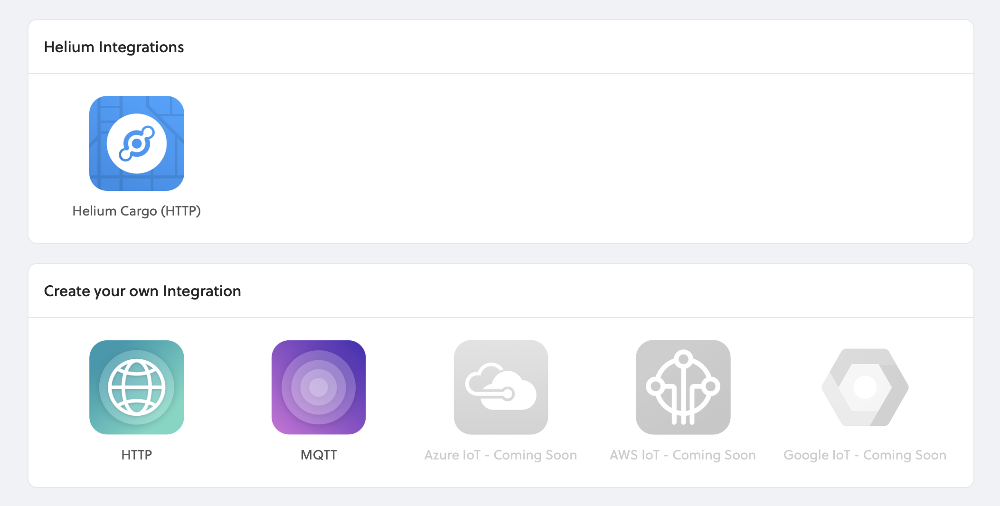

# Integrations

Integrations enable devices to connect to pre-configured, cloud-based applications or send data directly over HTTP or MQTT.

## Add Integration

To add a new integration, navigate to the **Integrations** page using the left side navigation, and then select from the available integrations as shown below. Follow the specific integration guides below for more details.

## Connecting Integrations to Devices

Devices are connected to integrations through the use of Labels. Labels are named identifiers that can be used to associate an integration with a device. To connect one or more devices to one or more integrations, simply attach the same label to both the device and integration. Labels need to be created before attaching them to devices and integrations. \(See more instructions [here](../labels.md).\)

