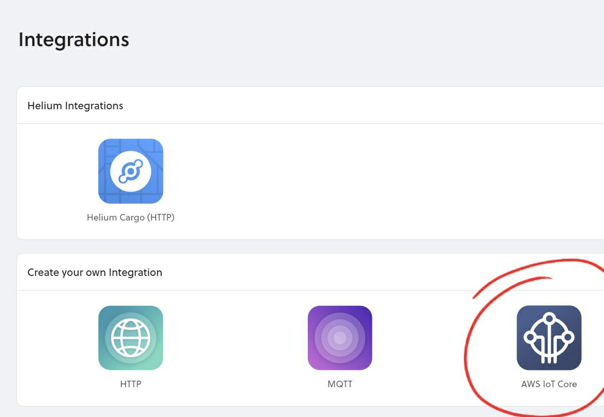

# AWS IoT Core

[AWS IoT Core](https://aws.amazon.com/iot-core/) is a powerful offering that lets developers build device-based applications and services on the AWS Cloud. And this Integration via Helium Console automates the complexity of securely connecting your devices to AWS IoT Core. 

### Add an AWS IoT Core Integration

To add an **AWS IoT Core Integration**, go to **Integrations** on the left-hand menu. Select the integration to add - in this case, the **AWS IoT Core** integration:

The next step is to create a new user with limited permissions that this Integration will use.

Open up the [AWS Console](https://console.aws.amazon.com/)

Under the Services menu in the upper-left, go to **Security, Identity, & Compliance**-&gt;**IAM**:

We are now going to create a new **User:**

Set the user name to "**HeliumIntegrationAccess**" and select only "**Programmatic access**"

We now attach a policy to the newly created user that defines what permissions they hold.

Select "**Attach existing policies directly**" and type "**AWSIoTConfigAccess"** into the "**Filter Policies**" box and check the box to the left of the row:


Ensure you record and store these keys securely, as you will not have an opportunity to get access to them again!


Back in the **Helium Console**, enter the credentials we just created under **AWS Connection Details**:

For **Topic**,  enter an MQTT compatible topic. For now, let's just enter `sensor`.

Finally, we give our new Integration a name:

And click **Create Integration**. Your new Integration is now ready for use. 

### Connecting Integrations to Devices

Devices are connected to integrations through the use of Labels. Labels are named identifiers, that can be used to associate an integration with a device. To connect one or more devices to one or more integrations, simply attach the same label to both the device and integration. Labels need to be created before attaching them to devices and integrations. You can read more about how to do that [here](https://developer.helium.com/console/labels).

### Viewing Integration in AWS IoT Core

Once a label has been set up to connect our devices to our new Integration, let's return to the [AWS Console](https://console.aws.amazon.com/), and go to **IoT Core** under the **Services** menu:

Here you are able to monitor the connections to AWS:

When data comes in from the Helium Network Integration, Things will be automatically created within AWS IoT Core:

Going to **Interact** on the left while on a **Thing** takes us to a list of topics for interacting with the **Thing Shadows**:

To monitor in real-time what is being sent to AWS from Helium, we can open the **MQTT monitor**, and subscribe to a topic with "\#" wildcard \(to catch all messages, or use the topic we set in **Helium Console** if just wanting to monitor those\).

The payload field is the actual data received from the device, [encoded in a base64](https://www.base64decode.org/) string.

### Integration Details

View the details of your integration by clicking on the Integration name.

**Integration Details** shows the integration ID that is unique to each integration, the name, the type of integration, and whether it is active or not.

**Devices Piped** lists all the devices that are currently sending their data to the selected integration.

**Update your AWS Connection Details** allows you to update your AWS connection details for the currently viewed integration.

### 

