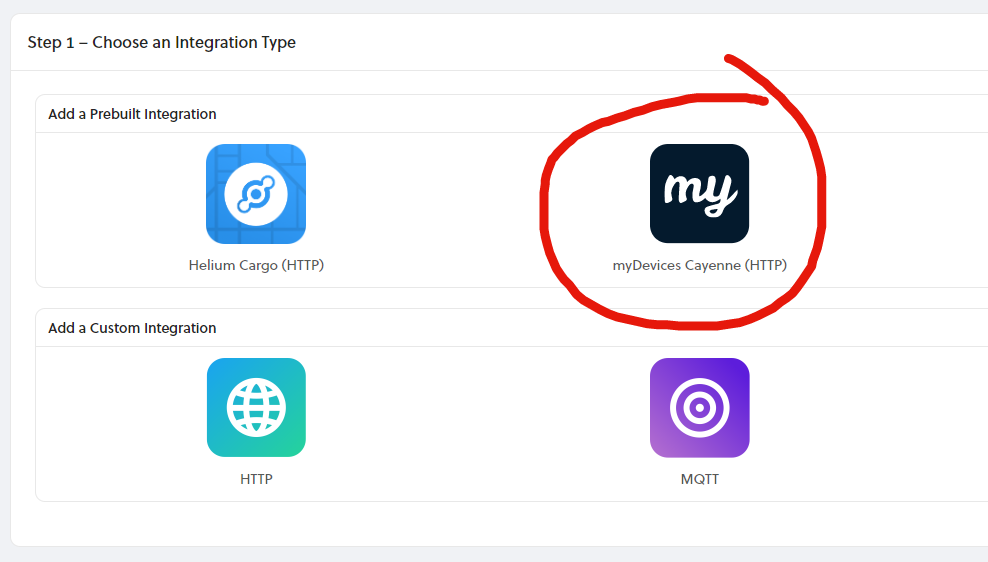

# myDevices Cayenne Integration

[Cayenne](https://developers.mydevices.com/cayenne/features/) from [myDevices](https://mydevices.com/), is a free, drag and drop IoT project builder, that empowers developers, designers and engineers to quickly prototype and share their connected device projects. Cayenne was designed to help users create Internet of Things prototypes and then bring them to production. It supports [hundreds of devices](https://developers.mydevices.com/cayenne/supported-hardware/), including everything from popular development boards to professional grade remote sensors. Cayenne offers both a web and mobile based application. 

### Add a myDevices Cayenne Integration

To add a **myDevices Cayenne** Integration, go to Integrations on the left-hand menu. Select the integration to add, in this case, the **myDevices Cayenne** integration:

The next step is to name the integration

Last, apply any optional Labels. For more information on Labels please visit the [Labels guide](https://github.com/helium/devdocs/tree/67b988ec351854ec4b7608e12b5b8f47f2456abf/console/labels/README.md).

## Connecting Integrations to Devices

Devices are connected to integrations through the use of Labels. Labels are named identifiers, that can be used to associate an integration with a device. To connect one or more devices to one or more integrations, simply attach the same label to both the device and integration. Labels need to be created before attaching them to devices and integrations. Read more on this [here](../labels.md).

### Adding Your Device on myDevices Cayenne 

Before adding your device to Cayenne, be sure you've successfully added it to the Helium network as well as attached it to a label that is also attached to the Cayenne integration, if you haven't done so yet, then see how to [here](../adding-devices.md).  Once you have a device added on Console and you have verified that packets are being received, you can then proceed to add the device on Cayenne.

First, signup for Cayenne [here](https://developers.mydevices.com/cayenne/signup/), if you have not already.

From the Cayenne dashboard, click **Add New** &gt; **Device / Widget**.

From the list of devices & widgets that appears, click **LoRa** and select the **Helium** Network option to view a list of Helium supported devices. 

Here we've selected the popular [STM32 B-L072Z-LRWAN1 ](https://www.st.com/en/evaluation-tools/b-l072z-lrwan1.html)LoRaWAN development board. 

The only information you'll need once you've selected your device is to enter the **DevEUI**, which is found on your device details page on Console,  shown below.

### Device Data Payload Format 

When adding your device on Cayenne, you'll need to pay close attention to whether or not the device requires the Cayenne Low Power Payload \(CayenneLLP\). If your device is in the list of supported devices, it will specify whether or not it requires CayenneLPP directly above the name field when you've selected the device, and shown in the Cayenne dashboard image above.  If you do not see the line 'This device uses Cayenne LPP', then it is automatically supported by Cayenne. You can find the official documentation on CayenneLLP [here](https://developers.mydevices.com/cayenne/docs/lora/#lora-cayenne-low-power-payload), as well as a popular Arduino library [here](https://github.com/ElectronicCats/CayenneLPP). If you have a custom device or it is not in the list of supported devices, then select the  [STM32 B-L072Z-LRWAN1](https://www.st.com/en/evaluation-tools/b-l072z-lrwan1.html) board as a placeholder, and be sure to use CayenneLPP formatting in your firmware. 

