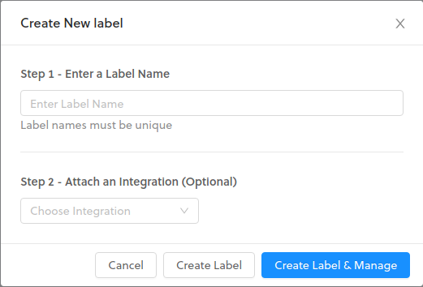

# Labels

Labels are a powerful mechanism used in Console for organization, integrations, and for versioning, and can provide both scalability and flexibility to your projects.

## Add Labels

When creating devices and integrations on Console, you will have the option to attach a custom Label to it. Before adding Labels to devices and integrations, you must create a new Label. To add a new Label, navigate to the **Labels** page using the left side navigation, and then click **Create New Label** in the upper right. You will be presented with the screen below.

## Attaching Labels

Labels can be attached to devices and integrations during or after creation. If you would like to attach a label to a device or integration during creation, make sure to create the label before hand, and it will be available to select. If you would like to attach a label after creating a new device or integration, go to the specific device or integration details page and find the label attachment dropdown to apply.

