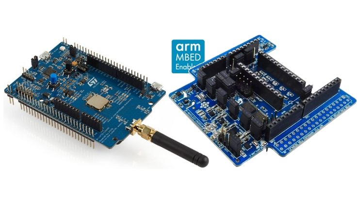

# Helium Developer Kit

The Helium Developer Kit is the perfect development setup to get started on the Helium network. It consists of two hardware parts, the main development board with a LoRa capable radio, and an expansion board with six environmental and motion MEMS sensors. This page will provide all the information you need to quickly and easily program your development board with the correct firmware, add the device to the Helium network using the Helium Console, and finally route the sensor data to somewhere you can view your data or begin building your application!

### Buy Your Helium Developer Kit


[Buy on Mouser](https://www.mouser.com/ProjectManager/ProjectDetail.aspx?State=EDIT&ProjectGUID=a405f943-5ada-49c3-b981-0a38541ed8ab)



[Buy on Digi-Key](https://www.digikey.com/ordering/shoppingcart)


### Part List & Resource Links

#### LoRaWAN Development Board - B-L072Z-LRWAN1

* [Overview](lorawan-development-board.md)
* [Product Page](https://www.st.com/en/evaluation-tools/b-l072z-lrwan1.html)
* [Manual](https://www.st.com/resource/en/user_manual/dm00352032-getting-started-with-ultralowpower-stm32l0-and-lora-discovery-kit-stmicroelectronics.pdf)

#### **Sensor Expansion Board - X-NUCLEO-IKS01A3**

* [Overview](sensor-expansion-board.md)
* [Product Page](https://www.st.com/en/ecosystems/x-nucleo-iks01a3.html)
* [Manual](https://www.st.com/resource/en/user_manual/dm00601501-getting-started-with-the-xnucleoiks01a3-motion-mems-and-environmental-sensor-expansion-board-for-stm32-nucleo-stmicroelectronics.pdf)

### Getting Started with Console

Before getting started with the device, it's best to get acquainted with Console, Helium's central tool for managing devices on the network. You can get started quickly, following our guide [here](../../console/quickstart.md).

### Programming Your Board

After you've added your device on Console, it's time to program your device and send data over the Helium network! You can learn how to do that, following our guide [here](../arduino-quickstart/st-discovery-lrwan1.md).

### Routing Device Data to Applications

Once you have your device transmitting data on the network, the last step is routing that data to some where so you can begin building applications. You can learn about all the Integration and how they work [here](../../console/integrations/). 

### 

