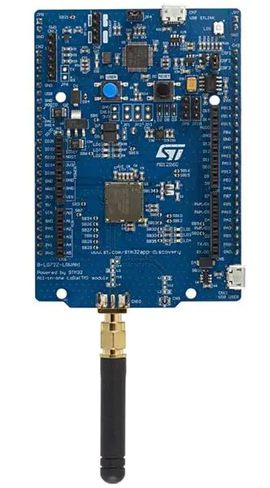

# LoRaWAN Development Board

The Helium Developer Kit is based on the ST B-L072Z-LRWAN1 LoRaWAN Development Board. This board includes the popular [Murata CMWX1ZZABZ-091](https://wireless.murata.com/type-abz-078.html) module, which is powered by a [STM32L072CZ ](https://www.st.com/en/microcontrollers-microprocessors/stm32l072cz.html)microcontroller and [SX1276 ](https://www.semtech.com/products/wireless-rf/lora-transceivers/sx1276)transceiver. The board also includes a fully featured ST-LINK/V2-1 embedded debug tool interface, LEDs, push-buttons, antenna, Arduino™ Uno V3 connectors and USB OTG connector in Micro-B format. Paired with the [ST X-NUCLEO-IKS01A3 Sensor Expansion Board](sensor-expansion-board.md), this kit will enable you to rapidly develop and test your end device applications on the Helium Network. To start transmitting data with the board, please visit our [quickstart ](../arduino-quickstart/st-discovery-lrwan1.md)guide.

### Resources

* [Product Page](https://www.st.com/en/evaluation-tools/b-l072z-lrwan1.html)
* [Manual](https://www.st.com/resource/en/user_manual/dm00352032-getting-started-with-ultralowpower-stm32l0-and-lora-discovery-kit-stmicroelectronics.pdf)
* [Schematic ](https://www.st.com/content/ccc/resource/technical/layouts_and_diagrams/schematic_pack/group1/0d/b2/51/b1/82/cd/44/42/X-NUCLEO-IKS01A3_SCHEMATIC/files/x-nucleo-iks01a3_schematic.pdf/jcr:content/translations/en.x-nucleo-iks01a3_schematic.pdf)

