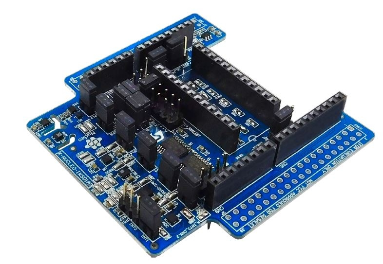
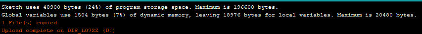
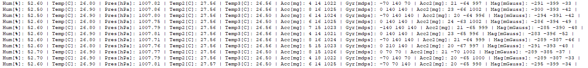

# Sensor Expansion Board

The Helium Developer Kit comes with the ST X-NUCLEO-IKS01A3, a sensor packed expansion board for environmental and motion sensing, that fits on top of the [ST B-L072Z-LRWAN1](lorawan-development-board.md).  This enables you to measure the following:

* Temperature \(-40 C to +125 C\) - STTS751
* Pressure \(260-1260 hPa\) - LPS22HH
* Relative Humidity & Temperature - HTS221
* Magnetism \(+/-50 gauss\) - LIS2MDL
* 3D Acceleration \(±2/±4/±8/±16 g\) - LSM6DSO
* 3D Orientation \(±125/±250/±500/±1000/±2000 dps\) - LSM6DSO

### Resources

* [Product Page](https://www.st.com/en/ecosystems/x-nucleo-iks01a3.html)
* [Manual](https://www.st.com/resource/en/user_manual/dm00601501-getting-started-with-the-xnucleoiks01a3-motion-mems-and-environmental-sensor-expansion-board-for-stm32-nucleo-stmicroelectronics.pdf)
* [ST Quick Start](https://www.st.com/content/ccc/resource/sales_and_marketing/presentation/product_presentation/group0/32/87/e4/bc/a6/e2/4a/b3/X-NUCLEO-IKS01A3_QUICK_START_GUIDE/files/x-nucleo-iks01a3_quick_start_guide.pdf/jcr:content/translations/en.x-nucleo-iks01a3_quick_start_guide.pdf)
* [Schematic ](https://www.st.com/content/ccc/resource/technical/layouts_and_diagrams/schematic_pack/group1/0d/b2/51/b1/82/cd/44/42/X-NUCLEO-IKS01A3_SCHEMATIC/files/x-nucleo-iks01a3_schematic.pdf/jcr:content/translations/en.x-nucleo-iks01a3_schematic.pdf)

### Quickstart - Reading Sensor Values

One of the quickest ways to start experimenting with the data from the sensors is to try one of the examples provided in the [Arduino library for the X-NUCLEO-IKS01A3](https://github.com/stm32duino/X-NUCLEO-IKS01A3).  If you haven't setup your Arduino environment to support the ST B-L072Z-LRWAN1 development board yet, which is what we'll actually be programming here, please visit the [quickstart ](../arduino-quickstart/st-discovery-lrwan1.md)guide first. 

To install the example sketch for the Sensor Expansion Board, open your Arduino IDE:

1. Navigate to Library Manager \(**Sketch &gt; Include Library &gt; Manage Libraries**\).
2. In the search box, type **ST X-NUCLEO-IKS01A3** into the search, select the version shown below, and click Install.
3. You will be prompted by a second window, click **Install all**.

#### Selecting Board

Next, we need to select the correct board to build for in the Arduino IDE. Navigate to \(**Select Tools &gt; Board: &gt; Discovery\)** and then once more  \(**Select Tools &gt; Board part number: &gt; Discovery L072Z-LRWAN1\)**  **.**

#### Programming **Example Sketch**

Now that we have the required Arduino library installed, lets program the board with the provided example sketch. In your Arduino IDE, \(**File &gt; Examples &gt; STM32duino X-NUCLEO-IKS01A3 &gt; X\_NUCLEO\_IKS01A3\_HelloWorld\).**  

#### Selecting Port

We're almost ready to upload our sketch, the very last step is to select the correct Serial port in the Arduino IDE. Navigate to \(**Tools &gt; Port: COM\# or /dev/ttyACM\#**\). You will also see either **COM\# or /dev/ttyACM\#** depending on whether you are on Windows, Mac, or Linux. 

#### Upload Sketch

We're finally ready to upload our sketch to the board. In the Arduino IDE, click the right arrow button, or navigate to \(**Sketch &gt; Upload\),** to build and upload your new firmware to the board. You should see something similar to the image below at the bottom of your Arduino IDE, when the upload is successful.

#### Viewing Serial Output

Let's use the Serial Monitor in the Arduino IDE to view the output from the board. Navigate to \(**Tools &gt; Serial Monitor**\), you should begin to see output similar to below.

