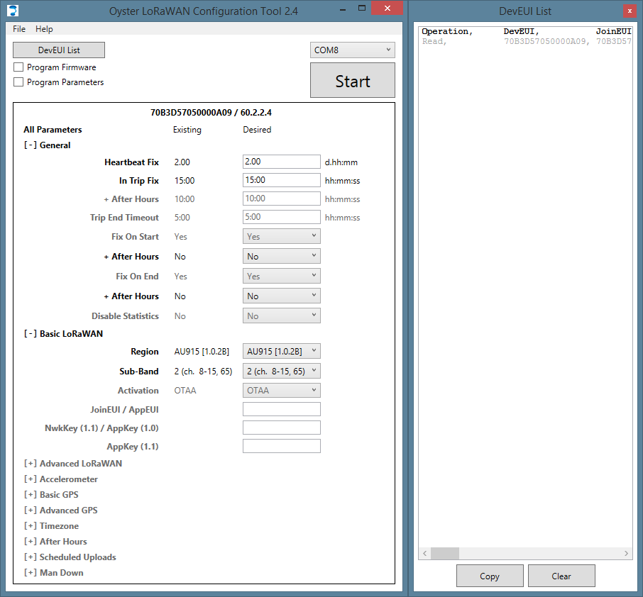

# Digital Matter LoRaWAN GPS

## Introduction

The Digital Matter Oyster/Yabby are rugged IP67 rated battery powered GPS tracking devices. This guide will show you the hardware and software setup steps required to provision and onboard these devices on the Helium Network.

Functionally, the Oyster and Yabby are both battery powered GPS tracking devices. Their main differences lie in form factor and battery life.  


### **Hardware:** 

* Digital Matter Oyster/Yabby
* 3 x AA 1.5V Batteries \(Oyster\)
* 3 x AAA 1.5V Batteries \(Yabby\)
* Digital Matter Configuration Cable
* Digital Matter Yabby Configuration Cable Adapter \(Yabby only\)

### **Software:** 

* \*\*\*\*[Helium Console](https://console.helium.com/)
* [Oyster Configuration Tool ](https://www.oemserver.com/tools/OysterLoRaWAN/ConfigTool/setup.exe)\(Windows\)
* [Yabby Configuration Tool ](https://www.oemserver.com/tools/YabbyLoRaWAN/ConfigTool/setup.exe)\(Windows\)

### **Hardware Setup:** 

The _Oyster and Yabby take 3 cells of their respective battery types. \(AA and AAA\)_

The Oyster uses a FTDI TTL to USB Serial Converter cable. 


This cable plugs into the four-pin connector below the battery compartment. 

The Yabby uses the same cable, but will need an additional adapter for the Pogo pins. 


Once the devices have been provisioned and the batteries are populated, the enclosure can be sealed by using the included screws.   
****

That’s it for hardware setup!   
****

### **Software Setup:** 

The Oyster/Yabby ship with a pre-provisioned AppEUI and AppKey. If you choose to use these credentials, you can leave the AppEUI and AppKey fields blank in the Windows utility. If you’d like to provision the device with new credentials, you must copy the AppEUI and AppKey from the device [created ](https://developer.helium.com/console/adding-devices)in Console.

The basic parameters of interest are as follows: 

```text
General:
In Trip Fix : hh:mm:ss : Will determine transmission frequency

Basic LoRaWAN:
	Region : US915 [1.0.2B]
	Sub-Band : 2 (ch. 8-15, 70)
	Activation : OTAA
	JoinEUI / AppEUI : [ Blank to use pre-provisioned / AppEUI from Console ]
	NwkKey (1.1) / AppKey (1.0) : [ Blank to use pre-provisioned / AppKey from Console ]

```

#### **Connecting your device:** 

When you plug in your cable, your PC will assign it a COM port, which you can retrieve from the Device Manager from the _**Ports \(COM & LPT\).**_

To access the device manager, press the Windows key on your keyboard and search for "Device Manager". 

Select the corresponding port from the drop-down list in the top right of the utility and click _**Start**_.

If the Program Firmware and Program Parameters boxes are left unchecked, the utility will  continuously read and display the current device settings without applying changes.



You can check logs by clicking the DevEUI List button on the top left, which will show a list of scanned DevEUIs and transactions. Each time a device is programmed, the parameter list will flash, and the DevEUI list will update. This list is available in CSV format, so it can be conveniently imported into a spreadsheet.  

To program the new parameters and firmware, enter the desired parameters in the right-hand column, and check the corresponding boxes to update _**firmware**_ and/or _**parameters**._  When you are finished, you may hit _**Stop**_, and disconnect your device. 

Once the device has been configured, it will attempt to join the Helium Network by transmitting join requests. If the device has been configured properly in Console and has knowledge of the device’s AppEUI and AppKey, the Hotspot that hears the join request will send a join-accept message and allow the device to join the network and transmit data. 

### **Usage:** 

These devices use an accelerometer to detect movement, allowing it to decide when an asset is in-trip and when it is stationary. This allows it schedule battery-hungry GPS fixes when appropriate, to optimize battery life. Each time a status update is scheduled, the device will attempt a GPS fix, then transmit results \(regardless of whether a fix succeeded or not\).

### Device Payload: 

A sample device payload is as follows: 

```text
DCCF3816BF5046B70000D3
```

When decoded becomes: 

```text
{
  "type": "position",
  "latitudeDeg": 37.282198,
  "longitudeDeg": -122.0128577,
  "inTrip": false,
  "fixFailed": false,
  "headingDeg": 0,
  "speedKmph": 0,
  "batV": 5.275,
  "manDown": null
}
```

To learn more about decoding this payload, you may use this [utility](https://www.oemserver.com/tools/OysterLoRaWAN/UplinkDecoder.html). To view the JavaScript sample code, you can view source. 

To learn more about routing this payload to our demo visualization tool, visit [Cargo](../../console/integrations/cargo.md). 

### Battery Life Estimate:



This spreadsheet will help estimate approximate battery life of the Digital Matter Oyster. Simply modify the fields to represent the desired number of transmissions within a day. 

### myDevices/Cayenne Integration:

Helium now supports myDevices and the Cayenne LPP \(low power payload\) format. Cayenne features a simple drag and drop interface that allows developers, designers and engineers quickly prototype and share their connected device projects. 

To learn more about myDevices Cayenne integration, visit [myDevices Cayenne](../../console/integrations/mydevices-cayenne-integration.md). 


myDevices currently only includes the Digital Matter Oyster in their device library. 


When you are adding a device/widget in Cayenne, look for the **Digital Matter Oyster** under **Helium.** 


Copy the device's **DevEUI** into the field. This value should correspond to the associated Digital Matter Oyster DevEUI in **Console.** Then, click **Add device.** 


That's it for adding a Digital Matter Oyster in myDevices Cayenne! 

  


