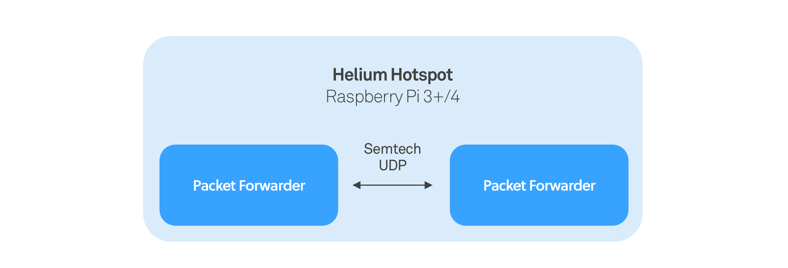
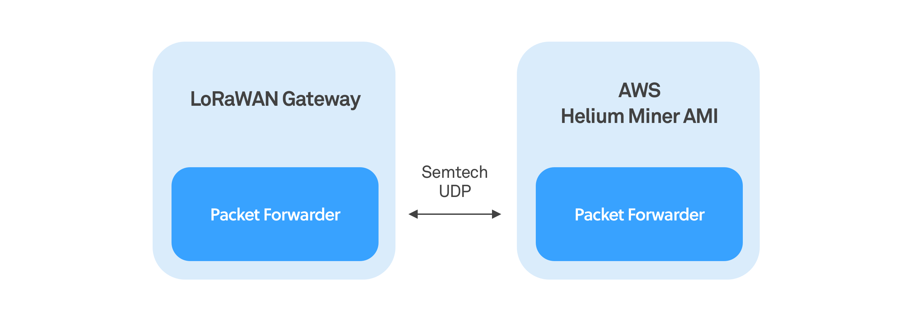
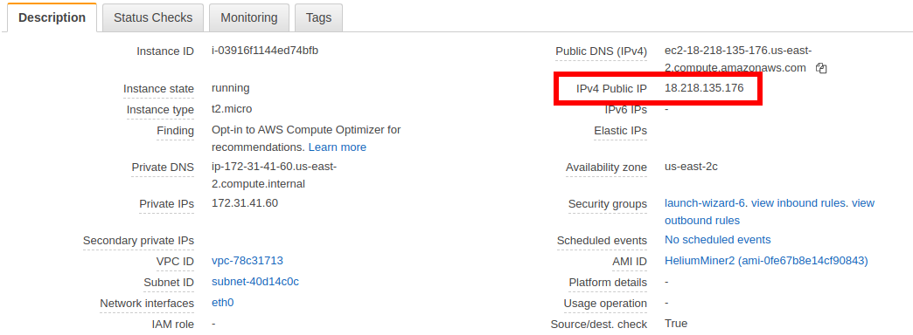

# Build a Hotspot


To be a Helium Miner, there are three principle components to know about

* Packet Forwarder: this is a utility that interacts with the radio front-end and sends and receives raw radio packets with the Helium Miner
* Miner: the Helium Blockchain comes into the picture here; the Miner is responsible for routing packets to the appropriate Router \(read more about that here\) entering into microtransactions brokered via libp2p
* Router: a Helium compatible LoRaWAN Network Server, basically; this component is interested in receiving the packets relating to its devices and handles downlink responses when appropriate

When you buy a Helium Hotspot, you are buying a Packet Forwarder and a Miner in a convenient package:



In this guide, we are going to do something a little different. We are going to decouple the Packet Forwarder and the Miner from one another from a hardware standpoint. This allows you to use almost any LoRaWAN Gateway on the Helium Network while also reducing the bandwidth and hardware requirements of the gateway hardware.



And rest assured, while this guide uses Amazon AMI images to makes Miner deployment more or less plug-and-play, we are working on a Docker container version which will make it easy to not only run other Cloud Service providers, but your own server hardware or perhaps even your own gateway if the hardware is sufficient.  
****


This guide is experimental and for advanced users only, and you may run in to various issues trying to get this working. We eventually intend to make it possible for LoRaWAN gateways of any kind to connect to our cloud-hosted Console directly without needing to follow these instructions.


## Example Custom Hardware

Any hardware that can run an 8 channel LoRa front-end \(such as SX1301 or SX1302\) and send and receive packets using the [Semtech UDP Protocol](https://github.com/Lora-net/packet_forwarder/blob/master/PROTOCOL.TXT) can be used to participate in the Helium Network. To fully participate in [all potential earning opportunities](../blockchain/mining-token-rewards.md#hnt-distributions-per-epoch), a gateway must also have a GPS module and feature some extensions to the standard Semtech UDP Protocol.

If you don’t have your own hardware yet, we recommend using a[ Raspberry Pi 3B+ or 4B](https://www.raspberrypi.org/) running the latest[ Raspian Buster](https://www.raspberrypi.org/downloads/raspbian/) image with a[ RAK2245 Pi Hat](https://store.rakwireless.com/products/rak2245-pi-hat) installed, and a recommended 64GB SD card.

If you already have hardware, we may just have a guide for [your LoRaWAN Hotspot](lorawan-gateway-migration/) already. In general, it is possible to use any LoRa gateway that can run Semtech's [packet forwarder](https://github.com/Lora-net/packet_forwarder) application and run the `miner` application on a separate host.

This README will assume a Raspberry Pi 3B+/4 with 1GB RAM + RAK2245 combination described above. This combination is available as a packaged product directly from RAK called the [Pilot Gateway](https://store.rakwireless.com/products/rak7243c-pilot-gateway?variant=26682434879588).

There are three distinct applications required in order for the Hotspot to send and receive LoRaWAN packets and route them to the correct internet hosted destination - [Miner](https://github.com/helium/miner), [packet\_forwarder](https://github.com/Lora-net/packet_forwarder), and [lora\_gateway](https://github.com/Lora-net/lora_gateway).

### Raspberry Pi specific setup

The current tested release is:

```c
Raspbian Buster Lite
====================
Minimal image based on Debian Buster
Version:September 2019
Release date:2019-09-26
Kernel version:4.19
Size:435 MB
```

The default Raspian image has a small swapfile of 100MB, which on a Pi with 1GB or less of RAM is insufficient for building some of the dependencies, such as [RocksDB](http://rocksdb.org/). To increase the swap size, first stop the swap:

```text
sudo dphys-swapfile swapoff
```

Edit the swapfile configuration and change the size of the swapfile:

```text
sudo nano /etc/dphys-swapfile
```

Edit the `CONF_SWAPSIZE` line so that it reads as follows:

```text
CONF_SWAPSIZE=1024
```

Save the file and exit by pressing `ctrl-x`, then reboot:

```text
sudo reboot
```

Next, enable SPI and I2C using the raspi-config tool:

```text
sudo raspi-config
```

Select `Interfacing Options`, and enable `I2C` and `SPI` from within the menu system.

Now let's go ahead and update our install with:

```text
sudo apt-get update
```


## Installing the Semtech packet forwarder

Once you have miner running, you'll need the Semtech packet forwarder to receive packets via SPI and the RAK2245 board and deliver them to the miner via UDP.

You may need to install git:

```text
sudo apt-get install git
```

Clone the git repository:

```text
$ cd ~
$ git clone https://github.com/Lora-net/packet_forwarder
$ git clone https://github.com/Lora-net/lora_gateway
```

We'll then download the Helium-specific packet forwarder configuration file :

```text
$ cd packet_forwarder/lora_pkt_fwd
$ wget https://helium-media.s3-us-west-2.amazonaws.com/global_conf.json
```

Note that we should have downloaded the configuration file to a specific directory. This will be important when launching the binary.

### One Quick Change

We need to modify the SPI speed for this particular RAK concentrator. You may not have to do this with different concentrators. To do that:

```text
cd ../.. && nano lora_gateway/libloragw/src/loragw_spi.native.c
```

And modify line 56 to read:

```c
#define SPI_SPEED       2000000
```

Now we are ready to build.

### Compiling the Packet Forwarder

Compile the packet forwarder:

```text
$ cd packet_forwarder
$ ./compile.sh
```

Before we can start the packet forwarder you will often have to issue a reset command to the RAK concentrator. In most cases you have to issue this command every time before starting the packet forwarder. This resets the concentrator using GPIO pin 17 of the Raspberry Pi, which is connected to the reset pin on the concentrator:

```text
../lora_gateway/reset_lgw.sh start 17
```

We can now start the packet forwarder:

```text
$ cd ~/packet_forwarder/lora_pkt_fwd
./lora_pkt_fwd
```

Note that we are doing from `~/packet_forwarder/lora_pkt_fwd` ; this is important for finding the configuration file downloaded previously.

That's it, now you're running a packet forwarder! The last step is connecting to a Helium Miner.

## **Connecting to a Helium Miner**

If you haven't done it yet, you'll want to get your [Helium Miner running](../blockchain/run-your-own-miner.md). We'll assume you've done this with an Amazon AMI for the sake of this tutorial. 

From Your EC2 dashboard, you should select your miner and take a look at the description at the bottom of the page:



In this case,  the IP is `18.218.135.176`. You now have to go back edit the packet forwarder's configuration such that it connects to you Miner on AWS. 

With your favorite editor,  open `packet_forwarder/lora_pkt_fwd/global_conf.json`:

```text
nano packet_forwarder/lora_pkt_fwd/global_conf.json
```

You want to change the field "server\_address" from "localhost" the the IP address of my server, so in this case:

```text
"server_address": "18.218.135.176",
```

You'll need to restart the packet forwarder for the configuration change to take effect. To verify that things are working, you can follow the logs **on the AWS instance:**

```text
tail -f /var/data/log/miner/console.log | grep lora
```

At the very least, you should see PULL\_DATA messages every few seconds. If so, then you've done it!

