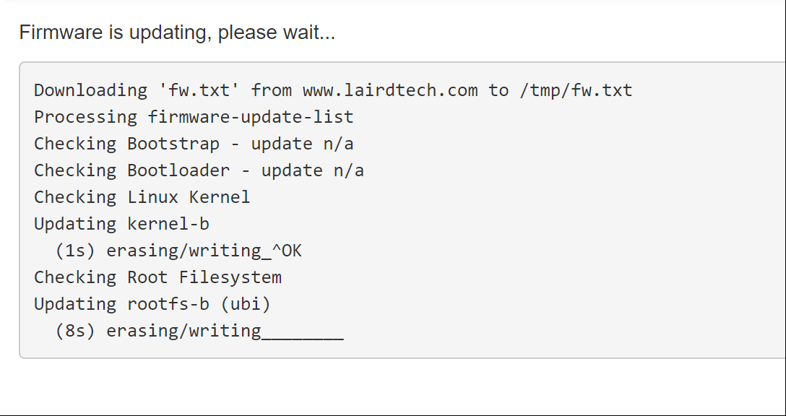

# Laird Sentrius RG191

## Introduction

This guide will help you connect a[ Laird Sentrius RG191](https://www.lairdconnect.com/wireless-modules/lorawan-solutions/sentrius-rg1xx-lorawan-gateway-wi-fi-ethernet-optional-lte-us-only) to the Helium Network using the Helium Miner. This will allow your gateway to participate in the Helium Network and to provide coverage!


[Laird Sentrius™ RG1xx LoRaWAN-Enabled Gateway](https://www.lairdconnect.com/wireless-modules/lorawan-solutions/sentrius-rg1xx-lora-enabled-gateway-wi-fi-ethernet)

## Log in to the Sentrius web console

Following the instructions in the [Quick Start Guide](https://connectivity-staging.s3.us-east-2.amazonaws.com/2020-03/CS-GUIDE-RG1xx-Quickstart%20v3_0.pdf) or the [User Guide](https://connectivity-staging.s3.us-east-2.amazonaws.com/2020-03/CS-GUIDE-RG1xx%20v4_0.pdf), log in to the web administration console for the Laird gateway. You will most likely get a certificate warning here, but you may safely ignore this \(Laird discusses this in their guides\).

## Ensure firmware is up to date:

Follow the instructions in the [User Guide](https://connectivity-staging.s3.us-east-2.amazonaws.com/2020-03/CS-GUIDE-RG1xx%20v4_0.pdf) to update to the most recent version of the firmware. The Firmware URL will differ depending upon what version you are currently running.



At the end of the update, you are prompted to reboot the gateway. Click **Reboot**. The gateway must be rebooted for the update to take effect.

## Ensure sub-bands are Helium compatible


No changes should need to be made on the sub-bands to support the Helium Network.

Rather than verifying the sub-band frequencies by hand, you can upload a saved LoRa configuration file under LoRa-&gt;Advanced in the Laird Web Console.



```javascript
{
    "data": {
        "name": "Sentrius configuration 2020-05-12T05:08:54.684Z",
        "country_code": "US"
    },
    "lora": {
        "logging_level": "debug",
        "gateway_mode": "semtech"
    },
    "forwarder": {
        "server_address": "ENTER_SERVER_ADDRESS_HERE",
        "serv_port_up": 1600,
        "serv_port_down": 1600,
        "keepalive_interval": 10,
        "stat_interval": 30,
        "push_timeout_ms": 100,
        "forward_crc_valid": true,
        "forward_crc_error": false,
        "forward_crc_disabled": false
    },
    "radios": {
        "radio_0": {
            "freq": 904300000
        },
        "radio_1": {
            "freq": 905000000
        },
        "chan_multiSF_0": {
            "enable": true,
            "radio": 0,
            "if": -400000
        },
        "chan_multiSF_1": {
            "enable": true,
            "radio": 0,
            "if": -200000
        },
        "chan_multiSF_2": {
            "enable": true,
            "radio": 0,
            "if": 0
        },
        "chan_multiSF_3": {
            "enable": true,
            "radio": 0,
            "if": 200000
        },
        "chan_multiSF_4": {
            "enable": true,
            "radio": 1,
            "if": -300000
        },
        "chan_multiSF_5": {
            "enable": true,
            "radio": 1,
            "if": -100000
        },
        "chan_multiSF_6": {
            "enable": true,
            "radio": 1,
            "if": 100000
        },
        "chan_multiSF_7": {
            "enable": true,
            "radio": 1,
            "if": 300000
        },
        "chan_Lora_std": {
            "enable": true,
            "radio": 0,
            "if": 300000,
            "bandwidth": 500000,
            "spread_factor": 8
        },
        "chan_FSK": {
            "enable": false
        }
    }
}
```


This is what the channels look like when configured for the Helium Network:


## Monitor Traffic Coming through the Device

Click the  **Start Polling** button in the upper-left, and, if you have a Helium node in the vicinity, you should start to see traffic. By clicking on a row, we can examine the packet details:


## **Connecting to a Helium Miner**

Next you'll need to get the [Helium Miner running](../../blockchain/run-your-own-miner.md). We'll assume you've done this with an Amazon AMI for the sake of this tutorial. 

From Your EC2 dashboard, you should select your miner and take a look at the description at the bottom of the page:


In this case,  the IP is `18.218.135.176`. You now have to go back edit the packet forwarder's configuration such that it connects to you Miner on AWS. 

Now you'll want to update your `Sentrius_LoRa_Config_2020-03-20T19_48_05.347Z.json` file to include the address of your miner as the "server\_address"

```text
"server_address": "18.218.135.176",
```

To verify that things are working, you can follow the logs **on the AWS instance:**

```text
tail -f /var/log/miner/console.log | grep lora
```

At this point ,  you should see `PULL_DATA` messages every few seconds. If so, then you've done it!


