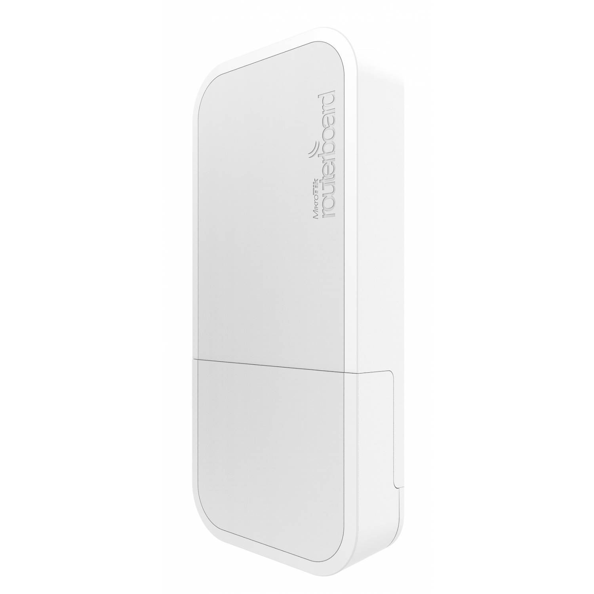
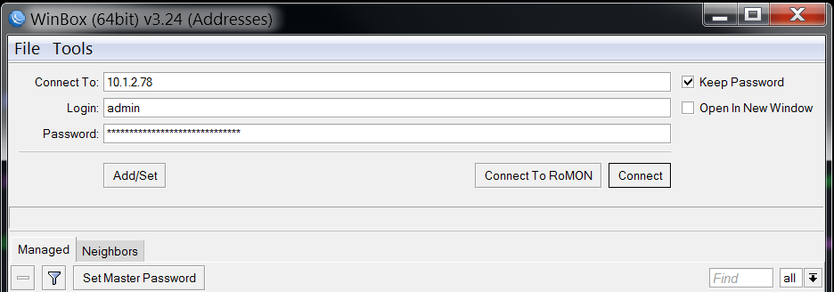
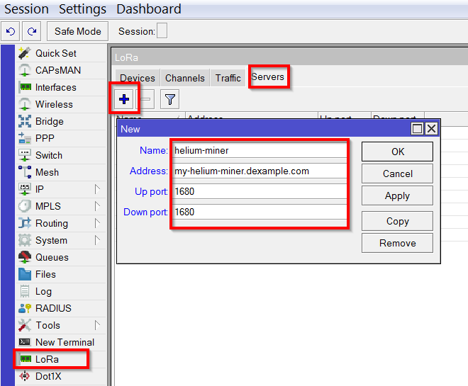
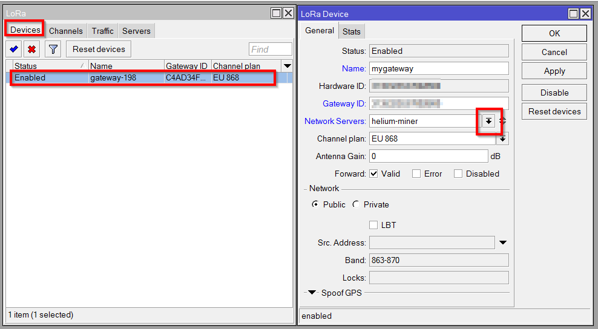

# MikroTik wAP LR8 / LR9




The ability to mine HNT with a 3rd party gateway is currently under development following the conclusion of the DIY Alpha program. Please join the [Helium Discord Server](https://discord.gg/helium) and the \#hotspot-diy-hardware channel for the latest updates on the roadmap and expected timelines.


MikroTik features [LoRaWAN Gateways for EU and US](https://mikrotik.com/products/group/iot-products). LR8 designates a model suitable for the EU market (863-870 MHz) and LR9 is for the US market (902-928 MHz).

## Prerequisites

#### Deploy Helium Cloud Miner

Using the MikroTik wAP LR8 on the Helium Network requires a running the blockchain miner in the cloud. [If you haven't already, get this deployed before moving on. ](../../blockchain/run-your-own-miner.md)

#### Download Winbox utility

MikroTik router boards can be configured in multiple ways. In this guide, we'll get you up and running using the [WinBox utility](https://wiki.mikrotik.com/wiki/Manual:Winbox) \(for Windows only\). Once you have downloaded and installed the utility, you can follow along with this guide.

Before starting, you'll want to connect the gateway via Ethernet, wifi or LTE so you can connect to it from your PC. Instructions are available in the [MikroTik wiki](https://wiki.mikrotik.com/wiki/Manual:First_time_startup).

## **1 - Connect**

Start WinBox and enter the connection details for the MikroTik router. Click "Connect".



## **2 -** Configure the Helium miner address



Click LoRa in the left menu to bring up the LoRa settings. Click the Servers tab. Click the + to add a new server. Enter the following:
| Field | Value |
|-------|-------|
| Name | helium-miner |
| Address | host name or ip-address of your miner |
| Up port | 1680 |
| Down port | 1680 |

Click OK.

## **3 -** Set the Network server address to the helium miner



Click the Devices tab. Double-click on the device to open the LoRa Device settings window. Click the drop-down for Network Servers and select helium-miner. Click OK.

## **4 -** Verification

Upon connection of a packet forwarder and a Miner, you should start seeing Semtech UDP frames appearing in the Miner logs.

For example, if your Miner is running in a docker container called `miner`, you can run the following command:

```text
docker exec miner tail -F /var/log/miner/console.log | grep lora
```

Every 10 seconds or so, you should see a `PULL_DATA` heartbeat from the forwarder to the Miner. If that is not happening, double check the IP address / host name and port configured above. If that looks okay, make sure that UDP port on the Miner is open. On cloud services such as AWS, you'll need to open up ports as described [in the tutorial](../../blockchain/run-your-own-miner.md).

