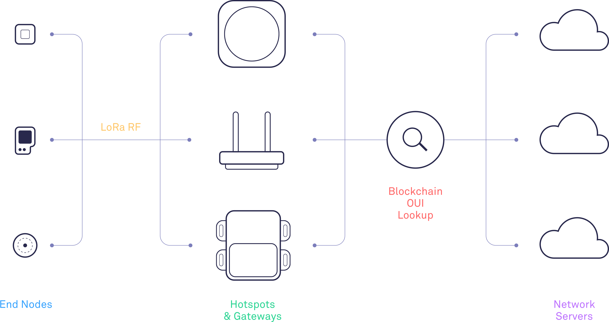
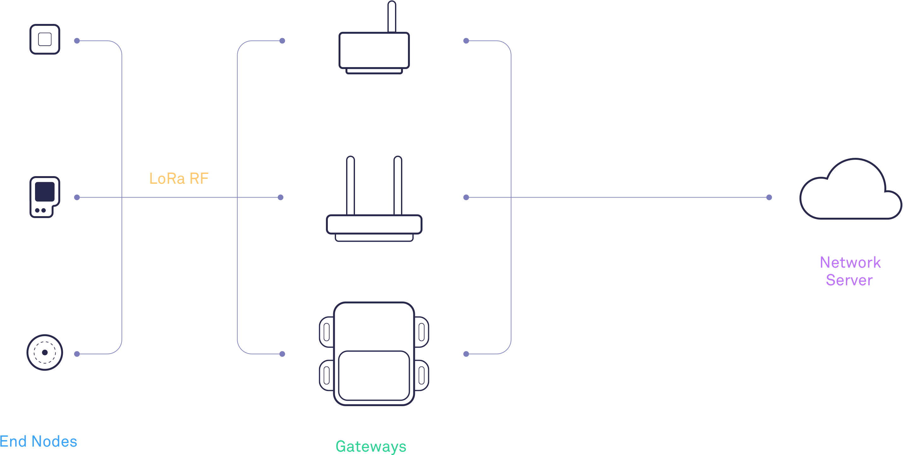

# Introduction

LongFi is where the Helium blockchain and the LoRaWAN radio protocol intersect. The uniqueness of LongFi versus a traditional LoRaWAN architecture is that we use the blockchain \(sometimes called a `decentralized ledger`\) to enable routing to many Network Servers.

Illustrated in the graphic below, LongFi improves on the standard LoRaWAN deployment with a blockchain-based OUI mechanism that enables seamless roaming across the entire Helium Network for any device.

### The Helium Network

The Helium Network is the largest, public LPWAN in the United States. It exists to route data for LoRaWAN-enabled devices. You can view [a live coverage map and network statistics here](https://network.helium.com/coverage).

Hotspots run a traditional LoRaWAN packet forwarder, similar to [the one from Semtech](https://github.com/Lora-net/packet_forwarder).

Rather than forward to a centralized Network Server, however, the packet is forwarded to the [Helium Miner](https://github.com/helium/miner), which will query the blockchain records to determine the Organization Unique Identifier \(OUI\) of the device \(see [Routing on LongFi](https://developer.helium.com/longfi/longfi-routing)\).

The OUI record provides the address of where the device’s Network Server exists. The Miner will broker the packet micro-transaction with the Network Server. Assuming the transaction is made, the LoRaWAN packet is delivered to the Network Server.

### **Helium's LongFi Architecture**

### **Traditional LoRaWAN Architecture**

