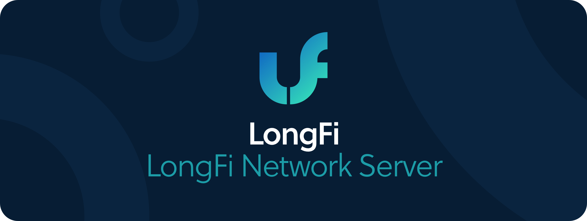

# LongFi Network Server

A LongFi Network Server is maintained and operated by anyone who has registered an OUI with the Helium blockchain.

The main difference between the LongFi Network Server and a traditional LoRaWAN Network Server is that a LongFi Network Server must know how to enter into micro-transactions with Miners who offer packets.

Other than that, the LongFi Network Server must simply support the appropriate LoRaWAN stack relative to the device, similar to any traditional LoRaWAN deployment. \(In fact, anyone who registers an OUI can host a LongFi Network Server and could implement an arbitrary RF protocol, as long as the uplink channels used and the uplink routing scheme is congruent with LongFi.\)

In addition, OUI registration requires Data Credits \(DCs\) which are currently live on the Helium Blockchain.

